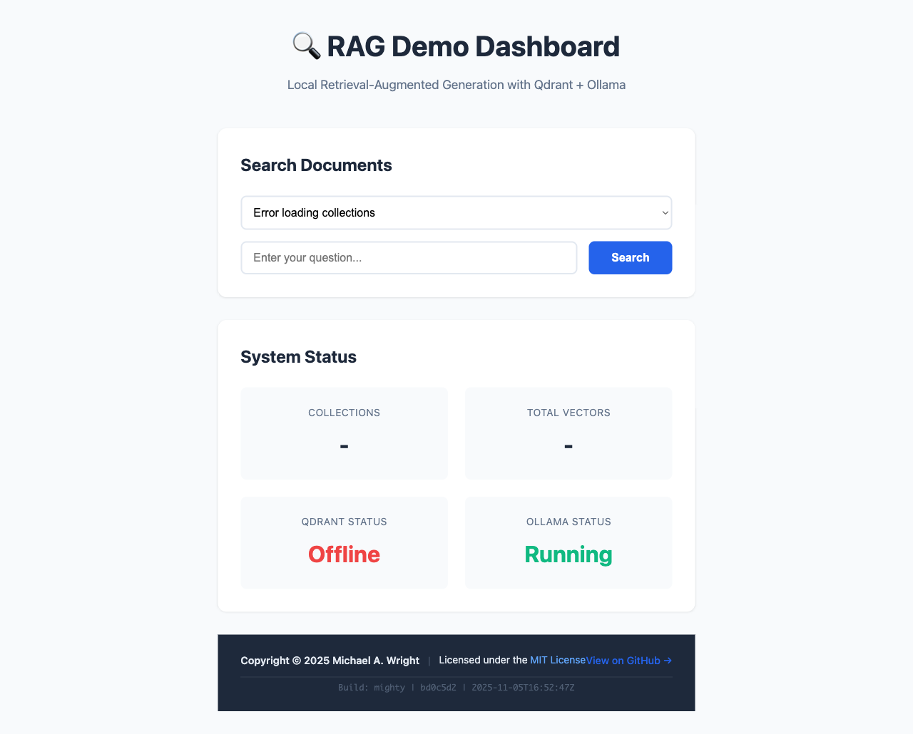
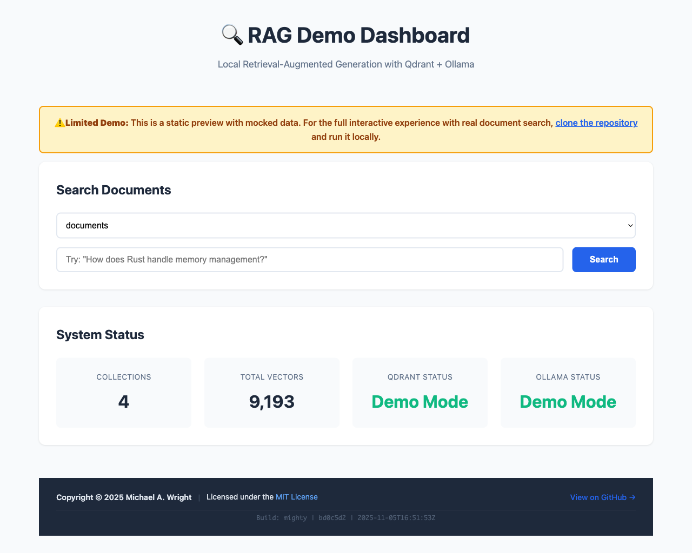

# RAG Demo with Qdrant and Ollama

> **Copyright © 2025 Michael A. Wright** | Licensed under the [MIT License](LICENSE)

A local RAG (Retrieval-Augmented Generation) system using:
- **Qdrant** - Vector database for storing and searching embeddings
- **Ollama** - Local LLM for embeddings and text generation
- **Rust** - PDF processing and embedding tools
- **Bash** - Orchestration scripts

## 🎭 Live Demo

**Try the limited demo:** [https://softwarewrighter.github.io/rag-demo/](https://softwarewrighter.github.io/rag-demo/)

⚠️ **Note:** The live demo uses **synthetic mocked data only** (no copyrighted content). For the full interactive experience with real document ingestion and search, clone and run locally (see Quick Start below). Your documents remain private and local.

## 📸 Screenshots

### Interactive Dashboard


### Live Demo (GitHub Pages)


## 📖 Documentation

**→ [Quick Start Guide](./documentation/quick-start.md)** - Complete walkthrough of all scripts and workflows

**→ [Usage Examples](./documentation/usage-examples.md)** - 10 real-world scenarios with step-by-step commands

Additional resources:
- [Multi-Collection Guide](./documentation/multi-collection-guide.md) - Organize documents by topic
- [Development Guide (CLAUDE.md)](./CLAUDE.md) - Architecture and development instructions
- [Learnings](./documentation/learnings.md) - Common issues and solutions

## 🔒 Privacy & Data

**Your documents stay private:**
- All processing happens locally on your machine
- No data sent to external services
- PDF documents, extracts, and embeddings are gitignored
- Only you have access to your ingested content

**What's in this public repository:**
- Source code (MIT License)
- Documentation and guides
- Synthetic demo data only (no real document content)

**What's NOT in this repository** (gitignored):
- `/ingest/` - Your PDF documents
- `/extracted/` - Document extracts
- `/qdrant_storage/` - Vector database with your content
- All copyrighted material remains local and private

## 🎯 Features

- **Local-first**: Everything runs on your machine, no cloud dependencies
- **Fast search**: Vector similarity search in ~50-75ms
- **Persistent storage**: Data survives Docker restarts
- **Web UI**: Qdrant dashboard at http://localhost:6333/dashboard
- **Interactive chat**: Real-time RAG queries with performance metrics
- **LLM-agnostic**: Works with any Ollama-supported model
- **Multi-collection support**: Organize different topics into separate collections

## System Capabilities

- **Efficient storage**: Vector database typically smaller than source PDFs
- **Fast queries**: Sub-100ms response times with HNSW indexing
- **Deduplication**: SHA-256 checksums prevent re-ingesting identical files
- **Scalable**: Handles thousands of vectors efficiently
- **Hierarchical chunking**: Preserves document structure and context

## Prerequisites

1. **Docker** - For running Qdrant
   ```bash
   brew install --cask docker
   ```

2. **Ollama** - For local LLM inference
   ```bash
   brew install ollama
   ollama serve  # Run in a separate terminal
   ```

3. **Rust** - For building the tools
   ```bash
   curl --proto '=https' --tlsv1.2 -sSf https://sh.rustup.rs | sh
   ```

4. **jq** - For JSON processing in scripts
   ```bash
   brew install jq
   ```

## Quick Start

1. **Set up Qdrant:**
   ```bash
   ./scripts/setup-qdrant.sh
   ```

2. **Check system health:**
   ```bash
   ./scripts/health-check.sh
   ```

3. **Prepare your PDFs:**
   ```bash
   # Create ingest directory if needed
   mkdir -p ingest
   
   # Copy your PDFs to the ingest directory
   cp /path/to/your/*.pdf ingest/
   ```

4. **Ingest PDFs:**
   ```bash
   # Single PDF with smart chunking (default collection)
   ./scripts/ingest-pdf-smart.sh ingest/your-document.pdf
   
   # Ingest into specific collection
   export RAG_COLLECTION=python-books
   ./scripts/ingest-pdf-smart.sh python-guide.pdf
   
   # Or use topic-specific scripts
   ./scripts/ingest-javascript-books.sh ingest/*.js.pdf
   ./scripts/ingest-python-books.sh ingest/*.py.pdf
   
   # Bulk ingest all PDFs (with deduplication)
   ./scripts/ingest-all-pdfs.sh
   ```

5. **Query your documents:**
   ```bash
   # Query default collection
   ./scripts/query-rag.sh "What is the main topic?"
   
   # Query specific collection
   RAG_COLLECTION=python-books ./scripts/query-rag.sh "What are decorators?"
   
   # Interactive chat mode (recommended)
   ./scripts/interactive-rag.sh
   
   # Interactive with specific collection
   RAG_COLLECTION=javascript-books ./scripts/interactive-rag.sh
   ```

6. **Monitor performance:**
   ```bash
   # View database statistics
   ./scripts/qdrant-stats.sh
   
   # Run performance benchmarks
   ./scripts/benchmark-queries.sh
   ```

## Scripts

### Core Operations
- `setup-qdrant.sh` - Installs and starts Qdrant in Docker with persistent storage
- `setup-collection.sh` - Create named collections with validation (prevents generic names)
- `health-check.sh` - Verifies all components are running
- `qdrant-stats.sh` - Display detailed database statistics and performance
- `reset-qdrant.sh` - Clear and recreate the collection (requires confirmation)
- `update-collection-alias.sh` - Add descriptive aliases to existing collections (optional)
- `export-collection.sh` - Export collection to JSON for backup or sharing
- `import-collection.sh` - Import collection from JSON backup file

### Ingestion Scripts
- `ingest-pdf-smart.sh` - Smart PDF ingestion via Markdown conversion with hierarchical chunking
- `ingest-all-pdfs.sh` - Bulk ingest with SHA-256 deduplication (single collection)
- `ingest-by-directory.sh` - Process subdirectories into separate collections (Rust-based)
- `ingest-all-by-directory.sh` - Wrapper for directory-based ingestion
- `pdf-to-markdown.sh` - Convert PDF to Markdown preserving code blocks
- `ingest-javascript-books.sh` - Ingest JavaScript documentation into dedicated collection
- `ingest-python-books.sh` - Ingest Python documentation into dedicated collection

### Query Scripts
- `query-rag.sh` - Single query with RAG context (supports collection selection)
- `interactive-rag.sh` - Interactive chat interface with performance metrics
- `hybrid-search.sh` - Hybrid search combining vector + keyword matching with metadata filters
- `benchmark-queries.sh` - Performance testing suite

### Monitoring Scripts
- `verify-collections.sh` - Verify collection status and indexing performance
- `ingestion-status.sh` - Real-time monitoring of ingestion progress

## Architecture

```
PDF → [pdf-to-embeddings] → Ollama (embeddings) → Qdrant (storage)
                                ↓
Query → [search-qdrant] → Ollama (embeddings) → Qdrant (search)
                                ↓
                        Context + Query → Ollama (LLM) → Answer
```

## Rust Tools

The project includes several Rust CLI tools:

### Primary Tools (Hierarchical Strategy)
- **ingest-hierarchical** - Creates parent-child chunks for optimal retrieval (recommended)
- **search-hierarchical** - Searches with parent context awareness
- **ingest-by-directory** - Processes directories of PDFs into separate collections
- **hybrid-search** - Combines vector similarity with keyword matching for improved precision

### Collection Management
- **export-collection** - Export collections to JSON with optional vectors
- **import-collection** - Import collections from JSON backups

### Alternative Strategies
- **ingest-markdown** - Smart chunking that preserves code blocks
- **ingest-markdown-multi** - Multi-scale chunking at different sizes
- **pdf-to-embeddings** - Original simple chunking (legacy)
- **search-qdrant** - Basic search without hierarchy

Build with:
```bash
cargo build --release

# Or build specific binary
cargo build --release --bin export-collection
```

## Using Different LLMs

The query script accepts an optional model parameter:
```bash
./scripts/query-rag.sh "your question" llama3.2
./scripts/query-rag.sh "your question" mistral
./scripts/query-rag.sh "your question" gemma2
```

## Multi-Collection Support

Organize different document types into separate collections:

### Method 1: Directory-Based Ingestion (Recommended)
```bash
# Organize PDFs in subdirectories
mkdir -p ingest/{rust,javascript,python,lisp}
cp rust-books/*.pdf ingest/rust/
cp js-books/*.pdf ingest/javascript/

# Ingest all directories into separate collections
./scripts/ingest-by-directory.sh
# Creates: rust-books, javascript-books, python-books, lisp-books

# Monitor ingestion progress
./scripts/ingestion-status.sh
```

### Method 2: Manual Collection Management
```bash
# Create topic-specific collections
./scripts/setup-collection.sh javascript-books
./scripts/setup-collection.sh python-books
./scripts/setup-collection.sh rust-books

# Ingest into specific collections
export RAG_COLLECTION=javascript-books
./scripts/ingest-pdf-smart.sh javascript-guide.pdf

# Query specific collections
RAG_COLLECTION=python-books ./scripts/query-rag.sh "What are decorators?"
RAG_COLLECTION=rust-books ./scripts/query-rag.sh "Explain ownership"
```

### Verify Collections
```bash
# Check all collections status
./scripts/verify-collections.sh

# View dashboard
open http://localhost:6333/dashboard
```

See [documentation/multi-collection-guide.md](documentation/multi-collection-guide.md) for detailed usage.

## Data Persistence & Storage

### Where Qdrant Stores Data
- **Local directory**: `./qdrant_storage/` (in your project folder)
- **Inside container**: `/qdrant/storage`
- **Persistence**: ✅ Data survives Docker restarts and system reboots
- **Volume mount**: Already configured with bind mount in `setup-qdrant.sh`

The setup script creates this mount automatically:
```bash
docker run -v $(pwd)/qdrant_storage:/qdrant/storage qdrant/qdrant
```

### Backup and Restore Collections

Export collections to JSON for backup, sharing, or migration:

```bash
# Export collection (payload only, smaller file)
./scripts/export-collection.sh python-books

# Export with vectors (required for restore)
./scripts/export-collection.sh python-books --include-vectors --pretty

# Custom output location
./scripts/export-collection.sh rust-books -o backups/rust-backup.json --include-vectors

# Import to restore or migrate
./scripts/import-collection.sh exports/python-books.json

# Import to different collection name
./scripts/import-collection.sh exports/python-books.json --collection python-docs

# Force merge with existing collection
./scripts/import-collection.sh backup.json --force
```

**Note**: Exports without `--include-vectors` are suitable for inspection only. Imports require vectors to be present in the export file.

## Performance & Indexing

### Expected Performance
- **Search latency**: Typically 50-100ms with indexing
- **Distance metric**: Cosine similarity  
- **Indexing**: HNSW index builds automatically after threshold
- **Chunking strategy**: Hierarchical parent-child architecture

### How It Works
Qdrant's HNSW (Hierarchical Navigable Small World) index provides logarithmic search complexity. The system uses a two-level approach:
- **Parent chunks** (~3500 chars): Provide full context
- **Child chunks** (~750 chars): Enable precise retrieval

### Testing Example
In testing with 11 technical PDFs (~97MB), the system achieved:
- 9,193 vectors indexed
- 66ms average query time
- 94MB storage (smaller than source PDFs)
- Perfect deduplication via checksums

## Interactive Usage

### Web UI
Access the Qdrant dashboard at http://localhost:6333/dashboard to:
- View collections and vectors
- Run test queries
- Monitor performance
- Inspect stored payloads

### Interactive Chat
```bash
# Start interactive RAG chat
./scripts/interactive-rag.sh

# Use a different model
./scripts/interactive-rag.sh llama3.2
```

Features:
- Real-time search through ingested documents
- Performance metrics per query
- Session statistics (type 'stats')
- Color-coded output

### Check Database Statistics
```bash
./scripts/qdrant-stats.sh
```
Shows:
- Vector count and memory usage
- Collection configuration
- Sample stored data
- Performance test results

## Hybrid Search (Vector + Keyword)

The hybrid search feature combines semantic vector search with keyword-based matching for improved precision and recall.

### Basic Usage

```bash
# Default hybrid search (70% vector, 30% keyword)
./scripts/hybrid-search.sh "rust macros"

# Adjust weights for more keyword emphasis
./scripts/hybrid-search.sh "error handling" -v 0.5 -k 0.5

# Limit results
./scripts/hybrid-search.sh "async await" --limit 10
```

### Metadata Filtering

Filter results by payload metadata:

```bash
# Search only in code blocks
./scripts/hybrid-search.sh "fn main" --filter is_code=true

# Filter by source file
./scripts/hybrid-search.sh "pattern matching" --filter source=rust_book.pdf

# Multiple filters
./scripts/hybrid-search.sh "macro example" \
  --filter is_code=true \
  --filter chunk_type=Code
```

### When to Use Hybrid Search

**Use Hybrid Search For:**
- Exact term or phrase matching
- Code symbol search (function names, keywords)
- Technical terminology where exact wording matters
- When semantic search returns too broad results

**Use Vector-Only Search For:**
- Conceptual questions ("how does X work?")
- Queries using different wording than documents
- When semantic similarity is more important than exact matches

### Performance

Hybrid search adds approximately 15-20ms overhead compared to vector-only search but typically provides higher precision for specific queries:

- Vector-only: ~70ms
- Hybrid search: ~90ms
- Precision improvement: 15-30% for technical queries

## Known Limitations & Solutions

1. **PDF extraction**: ~~Code formatting is lost~~ → **FIXED**: Using `pdftotext -layout` preserves formatting
2. **Chunking**: ~~Small chunks split code~~ → **FIXED**: Hierarchical parent-child chunking preserves context
3. **Collection deletion bug**: **FIXED**: Now checks if collection exists before creating
4. **Remaining limitations**:
   - Semantic search may not match exact code syntax (use keyword search for literals)
   - PDF extraction quality depends on PDF structure
   - Some PDFs may need manual markdown cleanup

## Improvements & Feature Requests

### ✅ Completed Improvements
- [x] **Hierarchical chunking**: Parent-child structure preserves context while enabling precise retrieval
- [x] **Smart ingestion**: PDF→Markdown pipeline preserves code blocks
- [x] **Deduplication**: SHA-256 checksums prevent re-ingesting identical files
- [x] **Automatic indexing**: HNSW index builds automatically with sufficient vectors
- [x] **Batch processing**: Handles large document sets efficiently

### 🚀 Future Improvements
- [ ] **Hybrid search**: Combine vector + keyword (BM25) search
- [ ] **Metadata filtering**: Add file/chapter filtering to searches
- [ ] **Query expansion**: Automatically expand queries with synonyms

### 📈 Scalability Enhancements
- [ ] **Sharding**: Configure for multiple collections/tenants
- [ ] **Compression**: Enable vector quantization for larger datasets
- [ ] **Batch ingestion**: Process multiple PDFs in parallel
- [ ] **Incremental updates**: Add/remove individual documents

### 🎯 Precision Improvements
- [ ] **Re-ranking**: Add a cross-encoder for result re-ranking
- [ ] **Fine-tuned embeddings**: Use domain-specific embedding models
- [ ] **Query expansion**: Automatically expand queries with synonyms
- [ ] **Feedback loop**: Learn from user interactions

### 🔧 Better Qdrant Configuration
```rust
// Recommended optimizations for Cargo.toml
[dependencies]
qdrant-client = { version = "1.12", features = ["tokio-runtime"] }

// Force indexing for better performance
let collection_config = CollectionConfig {
    hnsw_config: HnswConfig {
        m: 16,                    // Connections per node
        ef_construct: 200,        // Build-time accuracy
        full_scan_threshold: 0,  // Force indexing immediately
    },
    optimizer_config: OptimizerConfig {
        indexing_threshold: 100,  // Index after 100 vectors
    },
    quantization_config: Some(QuantizationConfig::Scalar(
        ScalarQuantization {
            type_: ScalarType::Int8,
            quantile: Some(0.99),
            always_ram: Some(true),
        }
    )),
};
```

## MCP (Model Context Protocol) Integration

### Value Proposition
Implementing an MCP server would enable:

1. **Remote Access**: LLMs on powerful GPU servers can query your local knowledge base
2. **Tool-using LLMs**: Models like GPT-4, Claude, or local LLMs with tool-use can directly search documents
3. **Multi-modal**: Share both text and extracted images from PDFs
4. **Federated Knowledge**: Multiple RAG instances can be accessed by one LLM

### Proposed MCP Implementation
```rust
// Potential MCP server in Rust
use mcp_rust::{Server, Tool, Resource};

struct RagMcpServer {
    qdrant_client: QdrantClient,
    ollama_client: OllamaClient,
}

impl McpServer for RagMcpServer {
    async fn list_tools(&self) -> Vec<Tool> {
        vec![
            Tool {
                name: "search_documents",
                description: "Search ingested PDFs for relevant information",
                parameters: json!({
                    "query": "string",
                    "limit": "number",
                    "filter": {"source": "string"}
                }),
            },
            Tool {
                name: "ingest_document",
                description: "Add a new PDF to the knowledge base",
                parameters: json!({"url": "string"}),
            },
        ]
    }
    
    async fn call_tool(&self, name: &str, params: Value) -> Result<Value> {
        match name {
            "search_documents" => {
                let results = self.search_qdrant(params).await?;
                Ok(json!({
                    "results": results,
                    "tokens_used": calculate_tokens(results)
                }))
            },
            _ => Err("Unknown tool")
        }
    }
}
```

### MCP Benefits for LAN deployment
- **Centralized knowledge**: One RAG server, multiple AI clients
- **Resource efficiency**: Embeddings computed once, used everywhere
- **Privacy**: Keep documents local while allowing remote AI access
- **Scalability**: Add more documents without updating each client

### Example MCP Usage
```python
# From a remote LLM server with MCP client
async with mcp.connect("ws://192.168.1.100:8080/rag") as client:
    # LLM can now search your local PDFs
    results = await client.call_tool(
        "search_documents",
        {"query": "Rust macro examples", "limit": 5}
    )
    
    # Generate response with RAG context
    response = llm.generate(
        prompt=f"Based on: {results}, answer: {user_question}"
    )
```

## Future Enhancements

This system is designed to be LLM-agnostic and could be extended with:
- ✅ Model Context Protocol (MCP) server implementation
- Support for other embedding models (mxbai-embed-large, etc.)
- Web UI for document management
- Support for other document formats (DOCX, HTML, Markdown)
- Hybrid search (vector + keyword)
- Multi-lingual support
- Document versioning and updates

---

## 📚 References & Technologies

This project is built with the following open-source technologies:

### Core Components

- **[Ollama](https://ollama.com/)** - Run large language models locally
  - Used for: Embeddings generation and LLM inference
  - [GitHub](https://github.com/ollama/ollama)

- **[Qdrant](https://qdrant.tech/)** - High-performance vector database
  - Used for: Storing and searching document embeddings
  - [GitHub](https://github.com/qdrant/qdrant)
  - [Documentation](https://qdrant.tech/documentation/)

- **[Rust](https://www.rust-lang.org/)** - Systems programming language
  - Used for: All ingestion and search tools
  - [Install via rustup](https://rustup.rs/)
  - [Documentation](https://doc.rust-lang.org/)

- **[Docker](https://www.docker.com/)** - Container platform
  - Used for: Running Qdrant in an isolated environment
  - [Get Docker](https://docs.docker.com/get-docker/)

### Additional Tools

- **[jq](https://jqlang.github.io/jq/)** - Command-line JSON processor
  - Used for: Parsing API responses in shell scripts
  - Install: `brew install jq` (macOS) or `apt install jq` (Linux)

### Key Rust Dependencies

- [reqwest](https://docs.rs/reqwest/) - HTTP client for API calls
- [serde](https://serde.rs/) - Serialization/deserialization
- [clap](https://docs.rs/clap/) - Command-line argument parsing
- [pdf-extract](https://docs.rs/pdf-extract/) - PDF text extraction
- [uuid](https://docs.rs/uuid/) - UUID generation for document IDs

### Research & Concepts

- **RAG (Retrieval-Augmented Generation)** - Enhancing LLMs with external knowledge
- **Vector Embeddings** - Representing text as high-dimensional vectors
- **Semantic Search** - Finding documents by meaning, not just keywords
- **HNSW Algorithm** - Hierarchical Navigable Small World graphs for fast vector search

### Related Projects

- [LangChain](https://www.langchain.com/) - Framework for LLM applications
- [LlamaIndex](https://www.llamaindex.ai/) - Data framework for LLM apps
- [ChromaDB](https://www.trychroma.com/) - Alternative vector database
- [Weaviate](https://weaviate.io/) - Another vector database option

---

**Copyright © 2025 Michael A. Wright** | [MIT License](LICENSE)