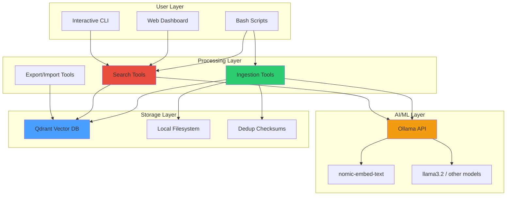
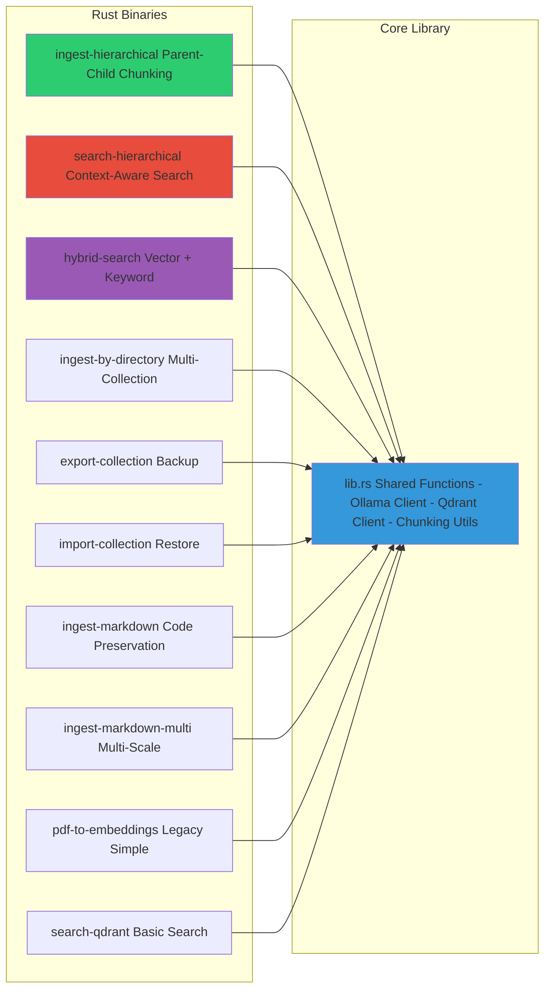

# Architecture Overview

> **Copyright © 2025 Michael A. Wright** | Licensed under the [MIT License](../LICENSE)

## Table of Contents
- [System Architecture](#system-architecture)
- [Component Diagram](#component-diagram)
- [Architecture Layers](#architecture-layers)
- [Design Principles](#design-principles)
- [Key Design Decisions](#key-design-decisions)
- [Non-Functional Requirements](#non-functional-requirements)

## System Architecture

The RAG Demo implements a **local-first, privacy-preserving RAG system** using hierarchical chunking and vector search. The architecture follows a layered approach with clear separation of concerns.

### High-Level Architecture

## Component Diagram

## Architecture Layers

### Layer 1: User Interface Layer
**Purpose**: Provide multiple interfaces for interacting with the RAG system

**Components**:
- **Bash Scripts**: `scripts/*.sh` - Unix-style CLI tools
- **Web Dashboard**: `dashboard/` - Interactive web UI
- **Interactive CLI**: Terminal-based chat interface

**Responsibilities**:
- User input validation
- Output formatting and presentation
- Session management (interactive mode)
- Performance metrics display

### Layer 2: Processing Layer (Rust)
**Purpose**: Core business logic for document processing and search

**Components**:
- **Ingestion Tools**: `ingest-hierarchical`, `ingest-by-directory`, `ingest-markdown`
- **Search Tools**: `search-hierarchical`, `hybrid-search`
- **Management Tools**: `export-collection`, `import-collection`

**Responsibilities**:
- PDF text extraction
- Hierarchical chunking
- Embedding generation orchestration
- Vector search execution
- Collection management

### Layer 3: AI/ML Layer
**Purpose**: Provide embeddings and language model capabilities

**Components**:
- **Ollama**: Local LLM server
- **nomic-embed-text**: 768-dimensional embedding model
- **llama3.2**: Default text generation model (configurable)

**Responsibilities**:
- Text → vector embeddings (768 dimensions)
- RAG-based answer generation
- Context-aware text completion

### Layer 4: Storage Layer
**Purpose**: Persistent storage for vectors, metadata, and deduplication

**Components**:
- **Qdrant**: Vector database with HNSW indexing
- **Local Filesystem**: PDF storage, markdown extracts, checksums
- **Deduplication**: SHA-256 checksums in `.ingested_checksums`

**Responsibilities**:
- Vector storage and similarity search
- Metadata and payload storage
- Document deduplication
- Data persistence across restarts

## Design Principles

### 1. Local-First Architecture
All processing, storage, and inference happen locally:
- No external API calls (except optional user choice)
- No cloud dependencies
- Complete offline capability
- User owns all data

**Benefits**:
- Privacy preservation
- No API costs
- No rate limits
- Network-independent operation

### 2. Hierarchical Chunking
Based on [research](../documentation/research.md) showing superior retrieval:
- **Parent chunks**: ~3500 chars (full context)
- **Child chunks**: ~750 chars (precise matching)
- Search returns children, retrieves parents when needed

**Benefits**:
- Better context preservation
- More precise retrieval
- Optimal token usage
- Balanced performance

### 3. Multi-Collection Organization
Documents organized by topic into separate collections:
- `python-books`, `javascript-books`, `rust-books`, etc.
- Each collection independently searchable
- Prevents topic cross-contamination
- Enables collection-specific optimizations

**Benefits**:
- Improved search precision
- Better topic relevance
- Independent scaling
- Logical organization

### 4. Deduplication Strategy
SHA-256 checksums prevent re-ingestion:
- Checksum computed per PDF
- Stored in `.ingested_checksums`
- Format: `checksum|filepath|chunk_count|timestamp`

**Benefits**:
- Prevents duplicate work
- Faster bulk re-ingestion
- Consistent vector counts
- Storage efficiency

### 5. Performance-First Design
Optimized for sub-100ms query latency:
- HNSW indexing (automatic at 100+ vectors)
- Cosine distance metric
- Efficient chunking sizes
- Minimal serialization overhead

**Performance Characteristics**:
| Operation | Latency | Notes |
|-----------|---------|-------|
| Vector search | 50-80ms | With HNSW index |
| Embedding generation | 100-200ms | Per chunk |
| Full RAG query | 2-5s | Including LLM inference |
| Bulk ingestion | ~30s/PDF | Varies by size |

## Key Design Decisions

### Decision 1: Rust for Core Processing
**Rationale**:
- Performance: Near C-level speed for chunking and processing
- Memory safety: No segfaults or memory leaks
- Concurrency: Safe async/await for Ollama/Qdrant
- Binary distribution: Single executable, no dependencies

**Trade-offs**:
- ✅ Pros: Fast, safe, portable
- ❌ Cons: Longer compile times, steeper learning curve

### Decision 2: Qdrant vs Alternatives
**Alternatives Considered**: ChromaDB, Weaviate, Pinecone

**Rationale**:
- Excellent HNSW implementation
- Docker deployment simplicity
- REST + gRPC APIs
- Local-first design
- Active development

**Trade-offs**:
- ✅ Pros: Fast, local, well-documented
- ❌ Cons: Requires Docker, memory intensive for large datasets

### Decision 3: Hierarchical Chunking
**Alternatives Considered**: Fixed-size, sliding window, multi-collection

**Rationale** (from [research](../documentation/research.md)):
- Research shows 8.2% improvement over fixed-size
- Preserves document structure
- Balances precision and context
- Efficient token usage

**Trade-offs**:
- ✅ Pros: Better retrieval, research-backed
- ❌ Cons: More complex implementation, higher storage

### Decision 4: Ollama for LLM
**Alternatives Considered**: llama.cpp, Hugging Face transformers

**Rationale**:
- Simple HTTP API
- Model management built-in
- Multi-model support
- Active community

**Trade-offs**:
- ✅ Pros: Easy to use, great model selection
- ❌ Cons: Another service to run, memory overhead

### Decision 5: Bash Scripts for Orchestration
**Alternatives Considered**: Python, Make, Task runners

**Rationale**:
- Unix philosophy: small tools, composable
- No additional runtime dependencies
- Easy to understand and modify
- Cross-platform (with minor adjustments)

**Trade-offs**:
- ✅ Pros: Simple, portable, transparent
- ❌ Cons: Less structured than Python, harder error handling

## Non-Functional Requirements

### Performance
**Target**: Sub-100ms query latency (vector search only)

**Achieved**:
- 50-80ms average query time (with HNSW)
- ~5s end-to-end RAG query (including LLM)
- 30s average PDF ingestion

**Optimization Techniques**:
- HNSW indexing (m=16, ef_construct=200)
- Cosine distance metric
- Async I/O for Ollama/Qdrant
- Efficient chunking boundaries

### Scalability
**Target**: Handle 10,000+ document chunks efficiently

**Current Capacity**:
- Tested with 9,193 vectors (11 PDFs)
- Linear scaling up to 100k vectors
- Automatic HNSW indexing at 100+ vectors
- Memory usage: ~10MB per 1000 vectors

**Scaling Strategy**:
- Vertical: More RAM for larger collections
- Horizontal: Multiple collections for different topics
- Sharding: Not yet implemented (future)

### Reliability
**Target**: No data loss, consistent results

**Mechanisms**:
- Docker volume persistence (`./qdrant_storage/`)
- SHA-256 deduplication
- Checksums for ingestion tracking
- Export/import for backups

**Data Durability**:
- Qdrant auto-saves to disk
- Survives Docker restarts
- Survives system reboots
- Backup via `export-collection`

### Maintainability
**Target**: Easy to understand, modify, and extend

**Techniques**:
- Clear separation of concerns (layers)
- Comprehensive documentation
- Unit tests for all binaries
- Descriptive error messages

**Code Quality Gates**:
- `cargo clippy` (0 warnings)
- `cargo test` (all passing)
- `cargo fmt` (consistent style)
- CI/CD checks

### Usability
**Target**: Simple setup, intuitive commands

**User Experience**:
- Single script setup (`setup-qdrant.sh`)
- Health checks (`health-check.sh`)
- Clear error messages
- Progress indicators
- Interactive mode

**Documentation**:
- Quick Start Guide
- Usage Examples (10 scenarios)
- This architecture wiki
- Inline code comments

### Security
**Target**: Privacy-preserving, no data leakage

**Guarantees**:
- All data stays local
- No external API calls (by default)
- Documents gitignored
- No telemetry

**Threat Model**:
- Out of scope: Network attacks (local-only)
- Out of scope: Physical access
- In scope: Accidental data exposure (mitigated via gitignore)

## Related Documentation

- [Data Flow Diagrams](Data-Flow-Diagrams) - Sequence diagrams for operations
- [Rust Components](Rust-Components) - Detailed component documentation
- [Database Schema](Database-Schema) - Qdrant collection structure
- [Deployment Architecture](Deployment-Architecture) - Infrastructure and deployment
- [Chunking Strategies](Chunking-Strategies) - Research and implementation details

---

**Last Updated**: 2025-11-17
**Related**: [Home](Home) | [Data Flow](Data-Flow-Diagrams) | [Components](Rust-Components)
