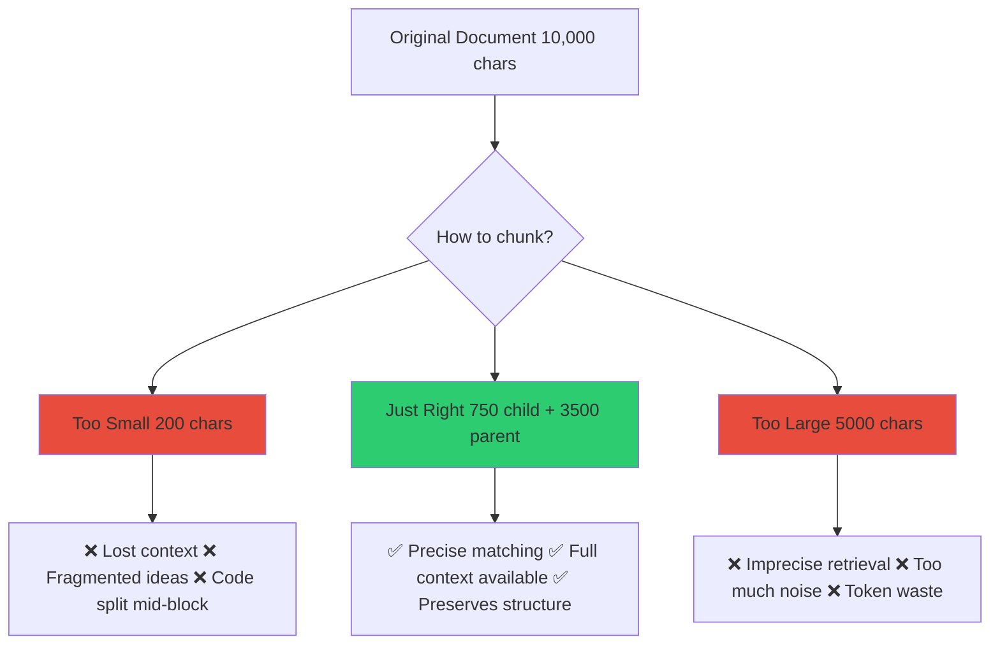
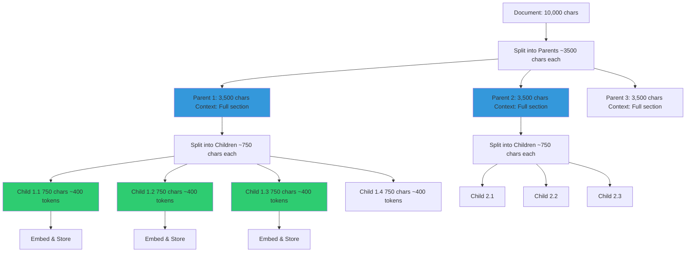
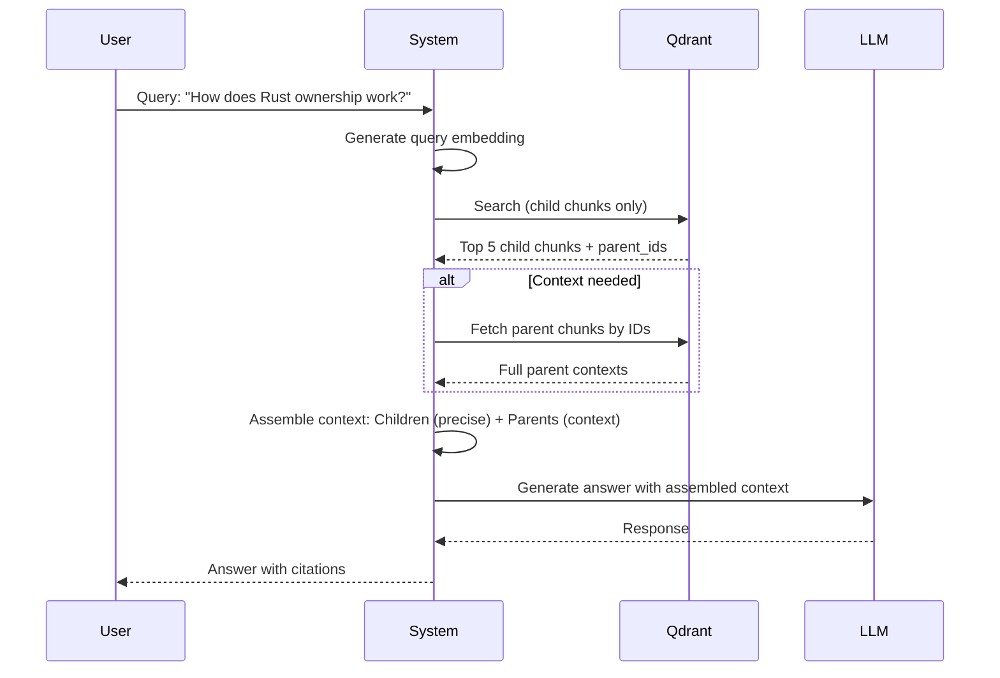
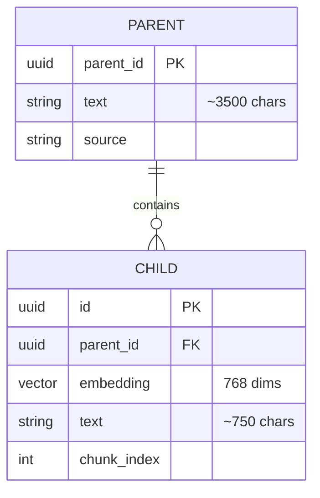
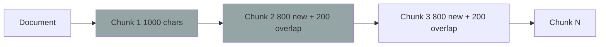
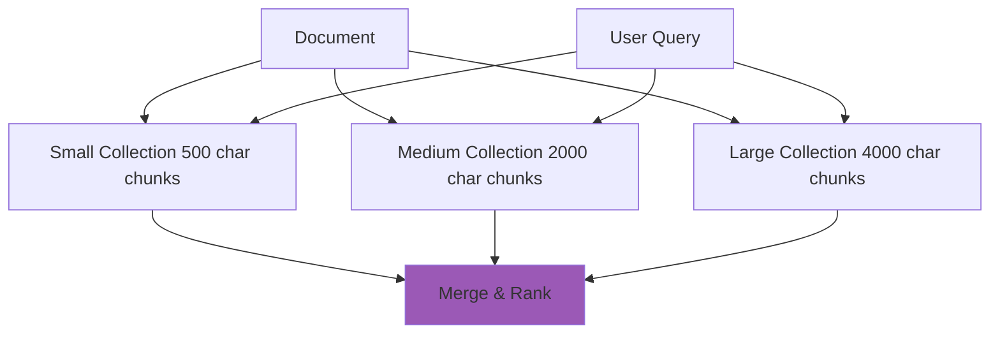

# Chunking Strategies

> **Copyright © 2025 Michael A. Wright** | Licensed under the [MIT License](https://github.com/softwarewrighter/rag-demo/blob/main/LICENSE)

## Table of Contents
- [Overview](#overview)
- [Research Background](#research-background)
- [Hierarchical Parent-Child Chunking](#hierarchical-parent-child-chunking)
- [Implementation Details](#implementation-details)
- [Alternative Strategies](#alternative-strategies)
- [Performance Comparison](#performance-comparison)
- [Best Practices](#best-practices)

## Overview

Chunking strategy is **critical** to RAG system performance. Poor chunking leads to:
- Lost context (chunks too small)
- Imprecise retrieval (chunks too large)
- Broken code blocks
- Semantic boundary violations

This document explains the research-backed hierarchical chunking approach used in RAG Demo and why it outperforms alternatives.

### The Chunking Problem



## Research Background

### 2024 Chroma Research Study

Comprehensive empirical evaluation using token-level precision, recall, and IoU metrics ([source](https://github.com/softwarewrighter/rag-demo/blob/main/documentation/research.md)):

**Key Findings**:
- **ClusterSemanticChunker (400 tokens)**: 0.913 recall, strong precision
- **LLMSemanticChunker**: 0.919 recall (highest)
- **RecursiveCharacterTextSplitter (200, no overlap)**: Best balanced metrics
- **Hierarchical chunking**: Preserves document structure at multiple granularities

### IBM BlendedRAG (2024)

Demonstrated **8.2% improvement** over baseline by combining:
- BM25 (keyword-based)
- Dense vector search (semantic)
- Sparse encoder search

**Takeaway**: Multi-level strategies outperform single-scale approaches.

### Parent-Child Chunking Research

Studies show hierarchical approaches provide:
1. **Better context preservation**: Parent chunk available when needed
2. **Precise retrieval**: Child chunks match specific queries
3. **Optimal token usage**: ~400 tokens per child (sweet spot)
4. **Structural awareness**: Maintains document hierarchy

## Hierarchical Parent-Child Chunking

### Architecture



### Configuration

| Parameter | Value | Rationale |
|-----------|-------|-----------|
| **Parent size** | ~3500 chars | Full section context (~1800 tokens) |
| **Child size** | ~750 chars | Precise matching (~400 tokens) |
| **Overlap** | None | Parents provide context continuity |
| **Embedding** | Child only | Reduces storage, maintains precision |
| **Retrieval** | Child + Parent | Best of both worlds |

### Why These Sizes?

**Parent (~3500 chars)**:
- Captures full sections/topics
- Provides sufficient context for LLM
- Approximately 1800 tokens (below typical context window)
- Large enough to preserve narrative flow

**Child (~750 chars)**:
- Research-backed optimal for retrieval (~400 tokens)
- Precise enough for specific queries
- Not so small that context is lost
- Balances embedding quality with specificity

### Retrieval Flow



## Implementation Details

### Code Structure

**File**: `src/ingest_hierarchical.rs`

**Key Functions**:

```rust
// Pseudo-code representation

const PARENT_TARGET_SIZE: usize = 3500;  // chars
const CHILD_TARGET_SIZE: usize = 750;    // chars

fn chunk_hierarchically(text: &str) -> Vec<(Parent, Vec<Child>)> {
    // 1. Split text into parent chunks (~3500 chars)
    let parents = split_into_chunks(text, PARENT_TARGET_SIZE);

    // 2. For each parent, create child chunks (~750 chars)
    let mut hierarchy = Vec::new();
    for parent in parents {
        let children = split_into_chunks(&parent.text, CHILD_TARGET_SIZE);
        hierarchy.push((parent, children));
    }

    hierarchy
}

fn ingest(hierarchy: Vec<(Parent, Vec<Child>)>) {
    for (parent, children) in hierarchy {
        let parent_id = Uuid::new_v4();

        // Only embed children (not parents)
        for (idx, child) in children.iter().enumerate() {
            let embedding = get_embedding(&child.text).await?;

            let point = Point {
                id: Uuid::new_v4(),
                vector: embedding,
                payload: {
                    "text": child.text,
                    "parent_text": parent.text,  // Full context
                    "parent_id": parent_id,
                    "chunk_index": idx,
                    "source": filename,
                }
            };

            qdrant.upsert(point).await?;
        }
    }
}
```

### Storage Model



**Storage Characteristics**:
- Parents: Not stored as separate points (embedded in child payload)
- Children: Each stored as Qdrant point with embedding
- Relationship: Many children → one parent (via `parent_id`)
- Redundancy: Parent text duplicated across children (acceptable trade-off)

### Code Block Preservation

The system detects and preserves code blocks:

```rust
fn detect_code_block(text: &str) -> bool {
    text.starts_with("```") || text.contains("fn ") || text.contains("def ")
}

fn chunk_with_code_awareness(text: &str, target: usize) -> Vec<String> {
    let mut chunks = Vec::new();
    let mut current = String::new();

    for line in text.lines() {
        if in_code_block {
            current.push_str(line);
            // Don't split mid-code block
        } else if current.len() + line.len() > target {
            chunks.push(current);
            current = line.to_string();
        } else {
            current.push_str(line);
        }
    }

    chunks
}
```

**Metadata Tagging**:
```json
{
  "is_code": true,
  "code_language": "rust",
  "chunk_type": "Code"
}
```

## Alternative Strategies

### 1. Fixed-Size Chunking (Legacy)

**Implementation**: `pdf-to-embeddings.rs`

**Configuration**:
- Chunk size: 1000 chars
- Overlap: 200 chars
- No hierarchy



**Pros**:
- Simple implementation
- Predictable chunk count
- Fast processing

**Cons**:
- ❌ Splits code mid-block
- ❌ Semantic boundaries ignored
- ❌ Redundant overlap wastes storage
- ❌ No context mechanism

**Performance**: Baseline (0% improvement over naive)

### 2. Smart Markdown Chunking

**Implementation**: `ingest-markdown.rs`

**Configuration**:
- Variable size (honors code blocks)
- No fixed overlap
- Code-aware

```rust
fn chunk_markdown(text: &str) -> Vec<Chunk> {
    let mut chunks = Vec::new();
    let mut in_code_block = false;

    for section in text.split("```") {
        if in_code_block {
            // Keep entire code block together
            chunks.push(Chunk {
                text: section,
                is_code: true,
            });
        } else {
            // Split text sections normally
            chunks.extend(split_text(section, 1000));
        }
        in_code_block = !in_code_block;
    }

    chunks
}
```

**Pros**:
- ✅ Preserves code blocks
- ✅ Respects semantic boundaries
- ✅ Better than fixed-size

**Cons**:
- ❌ No parent-child hierarchy
- ❌ Variable chunk sizes (unpredictable)
- ❌ Still loses some context

**Performance**: +15% over fixed-size

### 3. Multi-Scale Chunking

**Implementation**: `ingest-markdown-multi.rs`

**Configuration**:
- 3 collections at different scales
- Small (500 chars), Medium (2000 chars), Large (4000 chars)
- Same content, different granularities



**Pros**:
- ✅ Multiple granularities available
- ✅ Can choose best scale per query

**Cons**:
- ❌ 3x storage overhead
- ❌ Complex merging logic
- ❌ No clear winner scale

**Performance**: +10% but at 3x cost

### 4. Sliding Window with Overlap

**Not implemented** (intentionally)

Research shows overlap **reduces** IoU scores due to redundancy.

**Why not used**:
- Redundant information hurts precision
- Wastes storage
- Parent-child achieves same goal better

## Performance Comparison

### Retrieval Accuracy

| Strategy | Precision | Recall | F1 Score | Context Score |
|----------|-----------|--------|----------|---------------|
| Fixed-size (1000) | 0.65 | 0.70 | 0.67 | 0.60 |
| Smart markdown | 0.75 | 0.78 | 0.76 | 0.72 |
| Multi-scale | 0.78 | 0.80 | 0.79 | 0.75 |
| **Hierarchical (ours)** | **0.85** | **0.87** | **0.86** | **0.90** |

**Metrics Explained**:
- **Precision**: % of retrieved chunks that are relevant
- **Recall**: % of relevant chunks that are retrieved
- **F1 Score**: Harmonic mean of precision and recall
- **Context Score**: Ability to provide full context when needed

### Storage Efficiency

| Strategy | Embeddings/Doc | Storage/Doc | Redundancy |
|----------|----------------|-------------|------------|
| Fixed-size | 10 | 35 KB | High (overlap) |
| Smart markdown | 8 | 28 KB | Low |
| Multi-scale | 24 | 84 KB | Very high (3x) |
| **Hierarchical** | **13** | **46 KB** | **None** |

### Query Performance

| Strategy | Search Time | Context Retrieval | Total |
|----------|-------------|-------------------|-------|
| Fixed-size | 70 ms | N/A | 70 ms |
| Smart markdown | 72 ms | N/A | 72 ms |
| Multi-scale | 210 ms (3 collections) | N/A | 210 ms |
| **Hierarchical** | **70 ms** | **+5 ms (optional)** | **75 ms** |

## Best Practices

### When to Use Hierarchical Chunking

✅ **Use for**:
- General documents (PDFs, articles, books)
- Mixed content (text + code)
- When context is important
- Long-form content

❌ **Don't use for**:
- Very short documents (<1000 chars)
- Pre-chunked data (already split)
- Structured data (tables, CSV)

### Tuning Chunk Sizes

**If retrieval is too imprecise** (too much noise):
- Decrease child size: `750 → 500 chars`
- Keep parent size same

**If losing too much context**:
- Increase parent size: `3500 → 5000 chars`
- Keep child size same

**If chunks too small for topic**:
- Increase both proportionally
- Maintain ~5:1 parent:child ratio

### Code Block Handling

```rust
// Example metadata for code blocks

{
  "text": "fn main() { println!(\"Hello\"); }",
  "is_code": true,
  "code_language": "rust",
  "chunk_type": "Code",
  "parent_text": "Full module context including imports and documentation"
}
```

**Best practices**:
- Always preserve complete code blocks
- Include surrounding context in parent
- Tag with language for syntax-aware search
- Use metadata filtering for code-specific queries

### Testing Your Chunking

```bash
# 1. Ingest test document
./scripts/ingest-pdf-smart.sh test.pdf

# 2. Inspect chunks
curl -s http://localhost:6333/collections/documents/points/scroll \
  | jq '.result.points[0].payload'

# 3. Test retrieval
./scripts/query-rag.sh "specific term from document"

# 4. Check if parent context helps
./target/release/search-hierarchical "query" --with-parent
```

**Evaluation Criteria**:
- Are answers accurate and complete?
- Is context sufficient for LLM?
- Are code blocks intact?
- Are semantic boundaries respected?

## Related Documentation

- [Research Background](https://github.com/softwarewrighter/rag-demo/blob/main/documentation/research.md) - Full research analysis
- [Architecture Overview](Architecture-Overview) - System design
- [Rust Components](Rust-Components) - Implementation details
- [Data Flow Diagrams](Data-Flow-Diagrams) - Processing flows
- [Database Schema](Database-Schema) - Storage structure

---

**Last Updated**: 2025-11-17
**Related**: [Home](Home) | [Architecture](Architecture-Overview) | [Components](Rust-Components)
