# Data Flow Diagrams

> **Copyright © 2025 Michael A. Wright** | Licensed under the [MIT License](../LICENSE)

## Table of Contents
- [PDF Ingestion Flow](#pdf-ingestion-flow)
- [Hierarchical Chunking Flow](#hierarchical-chunking-flow)
- [Query Processing Flow](#query-processing-flow)
- [Hybrid Search Flow](#hybrid-search-flow)
- [Collection Export Flow](#collection-export-flow)
- [Collection Import Flow](#collection-import-flow)
- [Deduplication Flow](#deduplication-flow)

## PDF Ingestion Flow

### Single PDF Ingestion (Hierarchical)

```mermaid
sequenceDiagram
    participant User
    participant Script as ingest-pdf-smart.sh
    participant PDF as pdftotext
    participant IH as ingest-hierarchical
    participant Ollama
    participant Qdrant
    participant FS as Filesystem

    User->>Script: ./ingest-pdf-smart.sh doc.pdf
    Script->>FS: Check .ingested_checksums
    alt Already ingested
        FS-->>Script: Checksum exists
        Script-->>User: Skipping (already ingested)
    else New document
        Script->>PDF: pdftotext -layout doc.pdf
        PDF->>FS: Write markdown to ./extracted/
        Script->>IH: Launch with markdown file

        IH->>IH: Read markdown content
        IH->>IH: Hierarchical chunking (parent ~3500, child ~750)

        loop For each child chunk
            IH->>Ollama: POST /api/embeddings {model: nomic-embed-text, prompt: chunk}
            Ollama-->>IH: {embedding: [768 floats]}
        end

        IH->>Qdrant: Check collection exists
        alt Collection missing
            IH->>Qdrant: Create collection (768 dims, Cosine, HNSW)
        end

        IH->>Qdrant: Upsert points batch (vectors + metadata)
        Qdrant-->>IH: Success

        IH->>FS: Update .ingested_checksums SHA256|path|count|timestamp
        IH-->>Script: Ingestion complete
        Script-->>User: ✅ Success (N chunks ingested)
    end
```



### Bulk Ingestion with Deduplication


## Hierarchical Chunking Flow

### Parent-Child Chunk Creation


## Query Processing Flow

### Basic RAG Query

```mermaid
sequenceDiagram
    participant User
    participant Script as query-rag.sh
    participant Search as search-hierarchical
    participant Ollama
    participant Qdrant

    User->>Script: ./query-rag.sh "What is Rust?"
    Script->>Search: Execute with query

    Search->>Ollama: POST /api/embeddings {model: nomic-embed-text, prompt: query}
    Ollama-->>Search: {embedding: [768 floats]}

    Search->>Qdrant: POST /collections/{name}/points/search {vector: [...], limit: 5}
    Qdrant-->>Search: Top 5 similar chunks (with scores & metadata)

    Search->>Search: Extract text from results
    Search-->>Script: JSON results with context

    Script->>Script: Build RAG prompt: "Context: [...]\nQuestion: [...]"

    Script->>Ollama: POST /api/generate {model: llama3.2, prompt: rag_prompt}
    Ollama-->>Script: Streaming response

    Script-->>User: 📝 Answer with sources ⏱️ Search: 67ms 🤖 Generation: 3.2s
```



### Interactive RAG Session

```mermaid
sequenceDiagram
    participant User
    participant Script as interactive-rag.sh
    participant Search as search-hierarchical
    participant Ollama
    participant Qdrant

    User->>Script: ./interactive-rag.sh
    Script->>Script: Initialize session stats
    Script->>User: 🤖 RAG Chat (type 'quit' to exit)

    loop Chat Session
        User->>Script: Enter query

        alt Special command
            User->>Script: stats
            Script-->>User: 📊 Session statistics Queries: N, Avg time: Xms
        else Regular query
            Script->>Search: Execute search
            Search->>Ollama: Get query embedding
            Ollama-->>Search: Embedding
            Search->>Qdrant: Vector search
            Qdrant-->>Search: Results
            Search-->>Script: Context chunks

            Script->>Ollama: Generate answer
            Ollama-->>Script: Response

            Script->>Script: Update session stats
            Script-->>User: Answer + metrics
        end
    end

    User->>Script: quit
    Script-->>User: 👋 Goodbye! (session summary)
```



## Hybrid Search Flow

### Vector + Keyword Search

```mermaid
sequenceDiagram
    participant User
    participant Script as hybrid-search.sh
    participant HS as hybrid-search
    participant Ollama
    participant Qdrant

    User->>Script: ./hybrid-search.sh "rust macros" -v 0.7 -k 0.3 --filter is_code=true
    Script->>HS: Execute with params

    par Vector Search
        HS->>Ollama: Generate embedding
        Ollama-->>HS: Vector [768]
        HS->>Qdrant: Vector search (with metadata filter)
        Qdrant-->>HS: Vector results + scores
    and Keyword Search
        HS->>HS: Tokenize query: ["rust", "macros"]
        HS->>Qdrant: Fetch all matching filter
        HS->>HS: Compute BM25 scores
    end

    HS->>HS: Normalize scores (0-1)
    HS->>HS: Blend: score = 0.7*vec + 0.3*kw
    HS->>HS: Sort by blended score
    HS->>HS: Top K results

    HS-->>Script: Hybrid results
    Script-->>User: 📊 Results with scores Vector: X%, Keyword: Y%
```



### Keyword Scoring Algorithm

```mermaid
flowchart TD
    Start[Query: rust macros] --> Tokenize[Tokenize query]
    Tokenize --> Terms[Terms: rust, macros]

    Terms --> Fetch[Fetch documents matching filter]
    Fetch --> Docs[Document Set]

    Docs --> BM25[Compute BM25 Scores]

    BM25 --> TF[Term Frequency tf = count / total_terms]
    BM25 --> IDF[Inverse Doc Frequency idf = log(N / df)]

    TF --> Calc[BM25 Formula: sum over terms]
    IDF --> Calc

    Calc --> Norm[Normalize to 0-1]
    Norm --> Blend[Blend with vector scores]
    Blend --> Result[Final ranked results]

    style BM25 fill:#9b59b6
    style Blend fill:#e74c3c
```

## Collection Export Flow


## Collection Import Flow


## Deduplication Flow

### SHA-256 Checksum System


### Checksum File Format

```
# .ingested_checksums format
# SHA256|filepath|chunk_count|timestamp

e3b0c44298fc1c149afbf4c8996fb92427ae41e4649b934ca495991b7852b855|ingest/rust-book.pdf|342|2025-11-17T10:23:45
a1b2c3d4e5f6789012345678901234567890123456789012345678901234567890|ingest/javascript-guide.pdf|187|2025-11-17T10:25:12
```

## Multi-Collection Ingestion Flow

### Directory-Based Organization

```mermaid
sequenceDiagram
    participant User
    participant Script as ingest-by-directory.sh
    participant IBD as ingest-by-directory
    participant Ollama
    participant Qdrant

    User->>Script: ./ingest-by-directory.sh ./ingest
    Script->>Script: Scan directory structure

    Note over Script: ./ingest/rust/*.pdf → rust-books ./ingest/python/*.pdf → python-books ./ingest/javascript/*.pdf → javascript-books

    loop For each subdirectory
        Script->>IBD: Process directory → collection

        IBD->>Qdrant: Create collection: rust-books

        loop For each PDF in subdir
            IBD->>IBD: Extract text
            IBD->>IBD: Hierarchical chunking

            loop For each chunk
                IBD->>Ollama: Generate embedding
                Ollama-->>IBD: Vector
            end

            IBD->>Qdrant: Upsert points batch
        end

        IBD-->>Script: Collection complete
        Script-->>User: ✅ rust-books: 342 chunks
    end

    Script-->>User: 🎉 All collections created 3 collections, 876 total chunks
```



## Performance Metrics Flow

### Query Latency Breakdown


### Indexing Performance


## Related Documentation

- [Architecture Overview](Architecture-Overview) - High-level system design
- [Rust Components](Rust-Components) - Component implementation details
- [Database Schema](Database-Schema) - Qdrant data structures
- [Query Processing](Query-Processing) - Search algorithms in detail
- [Ingestion Workflows](Ingestion-Workflows) - Complete ingestion processes

---

**Last Updated**: 2025-11-17
**Related**: [Home](Home) | [Architecture](Architecture-Overview) | [Components](Rust-Components)
