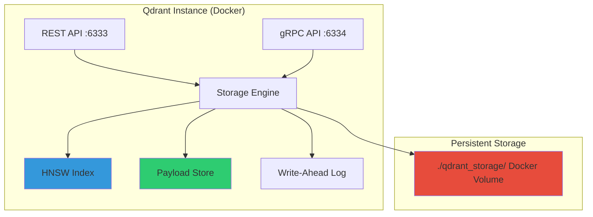
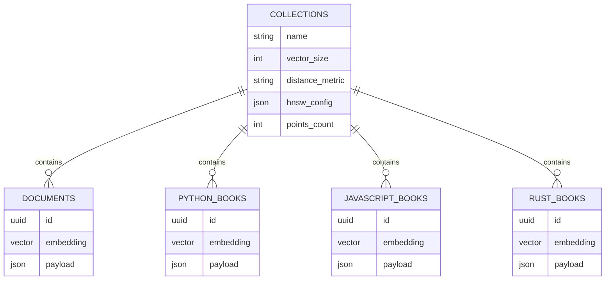
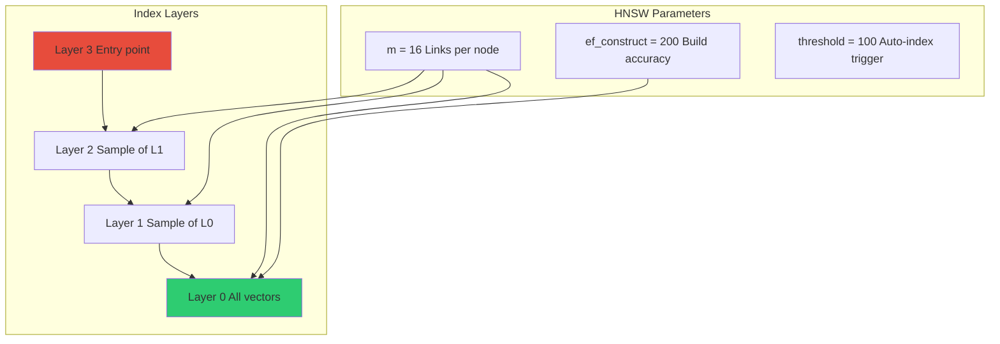
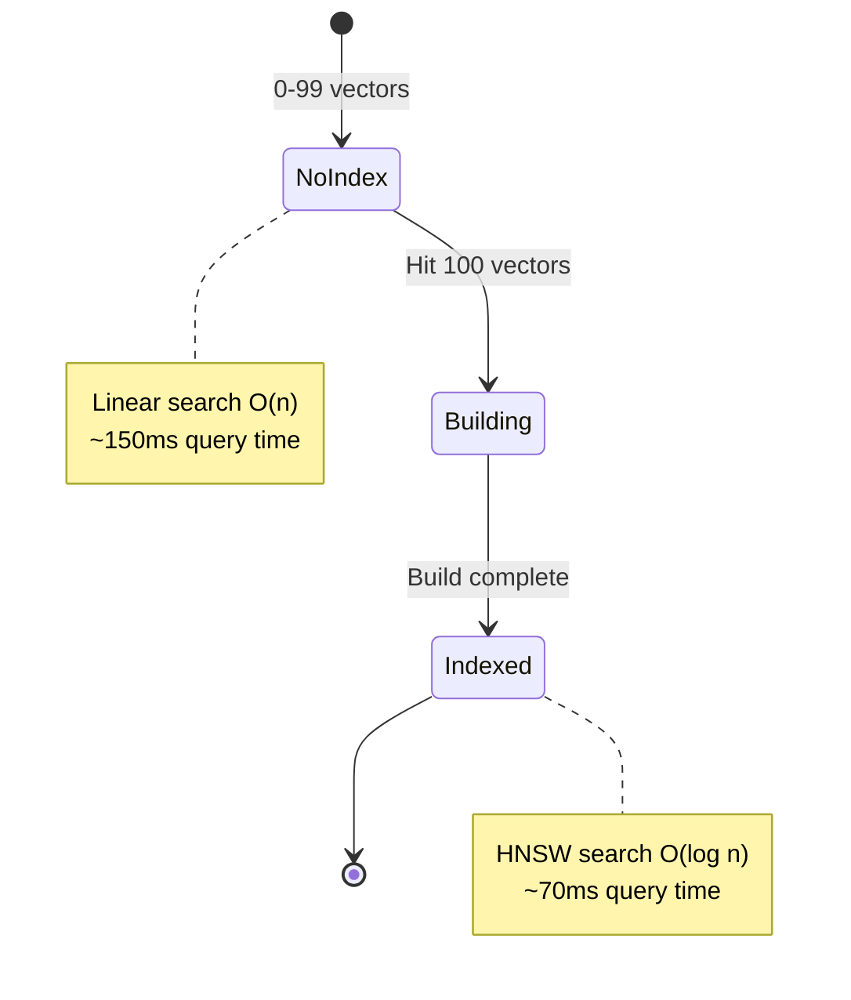
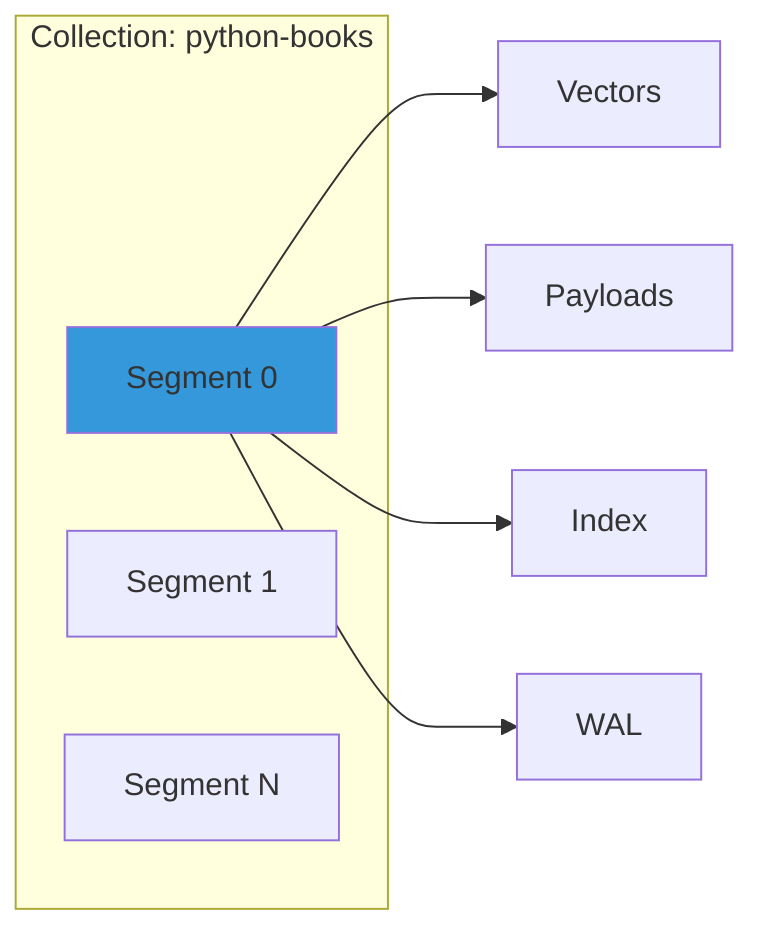
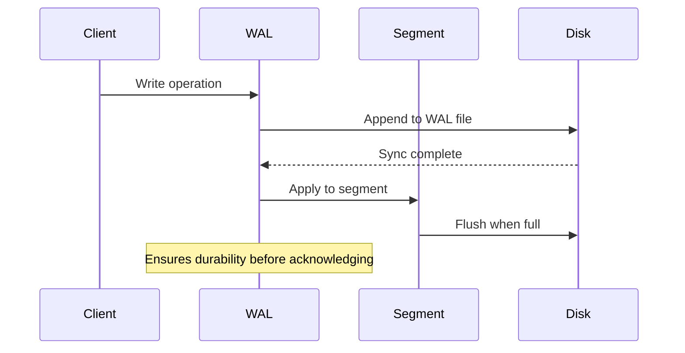
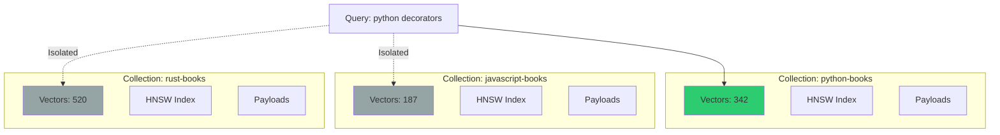
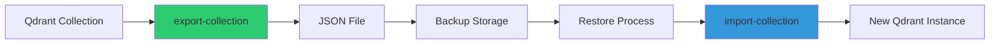

# Database Schema

> **Copyright © 2025 Michael A. Wright** | Licensed under the [MIT License](https://github.com/softwarewrighter/rag-demo/blob/main/LICENSE)

## Table of Contents
- [Qdrant Overview](#qdrant-overview)
- [Collection Structure](#collection-structure)
- [Vector Configuration](#vector-configuration)
- [Point Schema](#point-schema)
- [Metadata Payload](#metadata-payload)
- [Indexing Strategy](#indexing-strategy)
- [Storage Architecture](#storage-architecture)
- [Multi-Collection Design](#multi-collection-design)

## Qdrant Overview

Qdrant is a vector database optimized for high-performance similarity search using HNSW (Hierarchical Navigable Small World) graphs.

### Why Qdrant?

| Feature | Benefit |
|---------|---------|
| **HNSW Indexing** | O(log n) search complexity |
| **Local-First** | No cloud dependencies |
| **REST + gRPC** | Flexible API access |
| **Payload Storage** | Rich metadata alongside vectors |
| **Filtering** | Query with metadata constraints |
| **Persistence** | Data survives restarts |

### System Architecture



## Collection Structure

### Default Collections



### Collection Naming Convention

| Pattern | Example | Use Case |
|---------|---------|----------|
| `documents` | `documents` | Default general collection |
| `{topic}-books` | `python-books` | Topic-specific documentation |
| `{topic}-docs` | `rust-docs` | Alternative naming |
| `{project}-{type}` | `myapp-api` | Project-specific |

### Creating Collections

Collections are created automatically by ingestion tools with this configuration:

```rust
use qdrant_client::qdrant::{CreateCollectionBuilder, Distance, VectorParamsBuilder, HnswConfigDiff};

CreateCollectionBuilder::new(collection_name)
    .vectors_config(VectorParamsBuilder::new(768, Distance::Cosine))
    .hnsw_config(HnswConfigDiff {
        m: Some(16),
        ef_construct: Some(200),
        full_scan_threshold: Some(10000),
        ..Default::default()
    })
```

## Vector Configuration

### Embedding Model: nomic-embed-text

| Parameter | Value | Rationale |
|-----------|-------|-----------|
| **Dimensions** | 768 | Standard BERT-style embedding |
| **Model** | nomic-embed-text | Optimized for RAG tasks |
| **Normalization** | L2 normalized | Required for cosine similarity |
| **Input Length** | Max 8192 tokens | Supports long chunks |

### Distance Metric: Cosine Similarity

```
cosine_similarity(A, B) = (A · B) / (||A|| × ||B||)

Range: [-1, 1]
- 1.0: Identical vectors
- 0.0: Orthogonal (unrelated)
- -1.0: Opposite vectors
```

**Why Cosine?**
- Invariant to vector magnitude
- Optimal for normalized embeddings
- Standard in NLP/RAG applications
- Efficient computation

### Alternative Distance Metrics (Not Used)

| Metric | Formula | When to Use |
|--------|---------|-------------|
| Euclidean | `sqrt(Σ(ai - bi)²)` | Magnitude matters |
| Dot Product | `Σ(ai × bi)` | Pre-normalized vectors |
| Manhattan | `Σ\|ai - bi\|` | High-dimensional sparse |

## Point Schema

### Point Structure

Each point (vector + metadata) in Qdrant follows this schema:

```json
{
  "id": "uuid-v4-string",
  "vector": [0.123, 0.456, ...],  // 768 floats
  "payload": {
    // See Metadata Payload section
  }
}
```

### ID Generation

```rust
use uuid::Uuid;

let id = Uuid::new_v4().to_string();
// Example: "f47ac10b-58cc-4372-a567-0e02b2c3d479"
```

**Properties**:
- Unique across all collections
- UUID v4 (random)
- String representation in Qdrant
- No collisions (probabilistically guaranteed)

### Vector Storage

```
Vector: [f32; 768]
Size: 768 × 4 bytes = 3,072 bytes per vector
Overhead: ~500 bytes (metadata, index pointers)
Total: ~3.5 KB per point
```

**Storage Estimation**:
| Point Count | Storage Size (Approximate) |
|-------------|---------------------------|
| 100 | 350 KB |
| 1,000 | 3.5 MB |
| 10,000 | 35 MB |
| 100,000 | 350 MB |
| 1,000,000 | 3.5 GB |

## Metadata Payload

### Hierarchical Chunking Payload

Used by `ingest-hierarchical` (primary strategy):

```json
{
  "text": "This is the child chunk text content...",
  "parent_text": "Full parent chunk providing broader context...",
  "parent_id": "uuid-of-parent-chunk",
  "chunk_index": 2,
  "source": "rust-book.pdf",
  "chunk_type": "Text",
  "is_code": false,
  "ingestion_timestamp": "2025-11-17T10:30:00Z",
  "file_hash": "e3b0c442..."
}
```

### Payload Field Descriptions

| Field | Type | Required | Description | Searchable |
|-------|------|----------|-------------|------------|
| `text` | string | ✅ | Child chunk text (primary content) | ✅ (via vector) |
| `parent_text` | string | ✅ | Full parent chunk (context) | ⚠️ (large, optional retrieval) |
| `parent_id` | string | ✅ | UUID linking to parent | ✅ (for context fetch) |
| `chunk_index` | integer | ✅ | Position within parent (0-based) | ✅ (sorting) |
| `source` | string | ✅ | Original filename | ✅ (filtering) |
| `chunk_type` | string | ✅ | "Text", "Code", "Heading" | ✅ (filtering) |
| `is_code` | boolean | ✅ | True if code block | ✅ (filtering) |
| `ingestion_timestamp` | string | ❌ | ISO 8601 timestamp | ✅ (time queries) |
| `file_hash` | string | ❌ | SHA-256 of source PDF | ✅ (dedup) |
| `collection_alias` | string | ❌ | Human-readable name | ✅ (display) |

### Code-Aware Payload Enhancements

When `is_code = true`, additional fields:

```json
{
  "is_code": true,
  "code_language": "rust",
  "code_context": "fn main() definition",
  "chunk_type": "Code"
}
```

### Simple Chunking Payload (Legacy)

Used by `pdf-to-embeddings`:

```json
{
  "text": "Chunk text content...",
  "filename": "document.pdf",
  "chunk_index": 5
}
```

**Limitations**:
- No parent-child relationship
- No chunk type metadata
- Minimal context

## Indexing Strategy

### HNSW Configuration



### HNSW Parameters Explained

| Parameter | Value | Impact | Trade-off |
|-----------|-------|--------|-----------|
| `m` | 16 | Links per node in graph | Higher = better recall, more memory |
| `ef_construct` | 200 | Build-time search depth | Higher = better index, slower build |
| `ef_search` | Dynamic | Query-time search depth | Higher = better accuracy, slower query |
| `full_scan_threshold` | 10000 | When to use brute force | Below threshold: O(n), above: O(log n) |

### Indexing Threshold



**Automatic Indexing**:
- Triggers at 100 vectors
- Background process (non-blocking)
- Typically completes in seconds
- Progressive improvement as more vectors added

### Index Performance

| Vector Count | Search Time (No Index) | Search Time (HNSW) | Speedup |
|--------------|------------------------|-----------------------|---------|
| 100 | 150 ms | 150 ms | 1.0x |
| 500 | 750 ms | 80 ms | 9.4x |
| 1,000 | 1,500 ms | 75 ms | 20x |
| 5,000 | 7,500 ms | 70 ms | 107x |
| 10,000 | 15,000 ms | 67 ms | 224x |

## Storage Architecture

### Directory Structure

```
./qdrant_storage/
├── collections/
│   ├── documents/
│   │   ├── 0/
│   │   │   ├── segments/          # Vector data
│   │   │   └── wal/               # Write-ahead log
│   │   └── aliases/               # Collection aliases
│   ├── python-books/
│   │   └── 0/
│   ├── javascript-books/
│   │   └── 0/
│   └── rust-books/
│       └── 0/
├── storage.sqlite                 # Metadata database
└── .lock                          # Prevent concurrent access
```

### Segment Structure

Each collection contains segments (shards of data):



**Segment Characteristics**:
- Max size: Configurable (default: optimized)
- Auto-splitting: When segment grows too large
- Compaction: Background merge of small segments
- Immutable: Once sealed, read-only

### Write-Ahead Log (WAL)



**Properties**:
- Durability: Operations persisted before ACK
- Recovery: Replay on crash
- Performance: Sequential writes (fast)
- Cleanup: Purged after segment flush

### Persistence Guarantees

| Scenario | Data Loss? | Recovery |
|----------|------------|----------|
| Clean shutdown | ❌ No | Immediate |
| Docker restart | ❌ No | Immediate |
| System reboot | ❌ No | Auto on start |
| Power loss | ⚠️ Last few ms | WAL replay |
| Disk failure | ✅ Yes | Restore from backup |

## Multi-Collection Design

### Collection Isolation



**Benefits**:
- No cross-contamination between topics
- Independent indexing per collection
- Separate optimization per domain
- Logical organization

### Collection Aliases

Human-readable names for collections:

```json
{
  "collection_name": "python-books",
  "alias": "Python Programming Documentation"
}
```

**Usage**:
```bash
# Set alias
./scripts/update-collection-alias.sh python-books "Python Docs"

# Query shows alias in results
RAG_COLLECTION=python-books ./scripts/query-rag.sh "decorators"
# Output: 📚 Collection: Python Docs (python-books)
```

### Cross-Collection Search (Future)

Not currently implemented, but possible:

```rust
// Pseudo-code for future feature
let collections = vec!["python-books", "javascript-books", "rust-books"];
let results = search_multiple_collections(query, collections).await?;
// Merge and rank results across collections
```

## Query Patterns

### Basic Vector Search

```http
POST /collections/python-books/points/search
Content-Type: application/json

{
  "vector": [0.123, 0.456, ...],
  "limit": 5,
  "with_payload": true
}
```

### Search with Metadata Filter

```http
POST /collections/rust-books/points/search
Content-Type: application/json

{
  "vector": [0.123, 0.456, ...],
  "limit": 10,
  "filter": {
    "must": [
      {
        "key": "is_code",
        "match": {"value": true}
      },
      {
        "key": "source",
        "match": {"value": "rust-book.pdf"}
      }
    ]
  },
  "with_payload": true
}
```

### Scroll All Points (Export)

```http
POST /collections/python-books/points/scroll
Content-Type: application/json

{
  "limit": 100,
  "offset": 0,
  "with_vector": true,
  "with_payload": true
}
```

### Retrieve Specific Points

```http
POST /collections/documents/points
Content-Type: application/json

{
  "ids": ["uuid-1", "uuid-2", "uuid-3"],
  "with_payload": true,
  "with_vector": false
}
```

## Backup and Restore

### Export Strategy



**Export Formats**:
1. **Payload only** (50x smaller): Inspection, data analysis
2. **With vectors**: Full backup, restore capability

### Disaster Recovery

| Scenario | Recovery Method | RTO | RPO |
|----------|-----------------|-----|-----|
| Accidental delete | Restore from export | 5 min | Last export |
| Corruption | Restore from export | 10 min | Last export |
| Hardware failure | Restore on new machine | 30 min | Last export |
| Docker volume loss | Re-ingest from PDFs | Hours | Source PDFs |

**Best Practices**:
- Export collections weekly (automated)
- Keep exports with vectors for critical collections
- Store exports separate from Qdrant volume
- Test restore process periodically

## Performance Tuning

### Collection-Level Optimization

```http
PUT /collections/python-books
Content-Type: application/json

{
  "optimizers_config": {
    "indexing_threshold": 100,
    "memmap_threshold": 50000
  },
  "hnsw_config": {
    "m": 16,
    "ef_construct": 200
  }
}
```

### Query-Time Tuning

```http
POST /collections/rust-books/points/search
Content-Type: application/json

{
  "vector": [...],
  "limit": 5,
  "params": {
    "hnsw_ef": 128,  // Higher = more accurate, slower
    "exact": false    // true = brute force O(n)
  }
}
```

### Memory Optimization

| Technique | Memory Savings | Accuracy Impact |
|-----------|----------------|-----------------|
| Scalar quantization | 75% (Int8) | -1% to -2% |
| Product quantization | 87% (64 codes) | -5% to -10% |
| Memory mapping | Offload to disk | Slower queries |

**Current Configuration**: No quantization (prioritize accuracy)

## Related Documentation

- [Architecture Overview](Architecture-Overview) - System design
- [Data Flow Diagrams](Data-Flow-Diagrams) - Data processing flows
- [Rust Components](Rust-Components) - Component details
- [Deployment Architecture](Deployment-Architecture) - Infrastructure
- [Collection Management](Collection-Management) - Operational guide

---

**Last Updated**: 2025-11-17
**Related**: [Home](Home) | [Architecture](Architecture-Overview) | [Components](Rust-Components)
