# Deployment Architecture

> **Copyright © 2025 Michael A. Wright** | Licensed under the [MIT License](https://github.com/softwarewrighter/rag-demo/blob/main/LICENSE)

## Table of Contents
- [System Deployment Overview](#system-deployment-overview)
- [Component Deployment](#component-deployment)
- [Network Architecture](#network-architecture)
- [Storage Architecture](#storage-architecture)
- [Process Management](#process-management)
- [Resource Requirements](#resource-requirements)
- [Scaling Strategies](#scaling-strategies)
- [Monitoring & Health Checks](#monitoring--health-checks)

## System Deployment Overview

The RAG Demo system is designed for **local-first deployment** with all components running on a single machine. No cloud dependencies or external services required.

### Deployment Topology

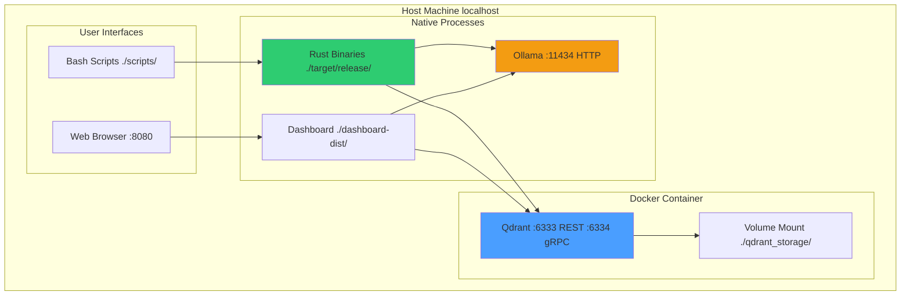

### Key Design Principles

1. **Local-First**: Everything runs on your machine
2. **No Root Required**: Runs in user space (except Docker)
3. **Portable**: Works on macOS, Linux, Windows (WSL)
4. **Stateless Binaries**: All state in Qdrant/filesystem
5. **Hot Swappable**: Update binaries without data loss

## Component Deployment

### 1. Qdrant (Docker Container)

**Container Name**: `qdrant`

**Image**: `qdrant/qdrant:latest`

**Ports**:
- `6333`: REST API
- `6334`: gRPC API (used by Rust client)

**Volumes**:
- `./qdrant_storage/` → `/qdrant/storage` (bind mount)

**Deployment**:
```bash
docker run -d \
  --name qdrant \
  -p 6333:6333 \
  -p 6334:6334 \
  -v "$(pwd)/qdrant_storage:/qdrant/storage" \
  -e QDRANT__SERVICE__GRPC_PORT="6334" \
  qdrant/qdrant
```

**Lifecycle**:
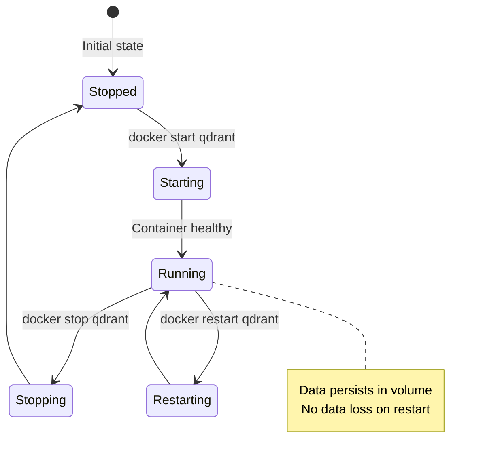

**Health Check**:
```bash
curl -s http://localhost:6333/collections | jq '.status'
# Expected: "ok"
```

### 2. Ollama (Native Process)

**Binary**: `ollama`

**Port**: `11434` (HTTP API)

**Models**:
- `nomic-embed-text`: 768-dim embeddings (274 MB)
- `llama3.2`: Default LLM (2 GB)
- User can add more: `ollama pull mistral`, etc.

**Deployment**:
```bash
# Start server (foreground)
ollama serve

# Or background with nohup
nohup ollama serve > ollama.log 2>&1 &
```

**Process Management**:
```bash
# Check if running
ps aux | grep ollama

# Kill process
pkill ollama

# View logs
tail -f ~/.ollama/logs/server.log
```

**Health Check**:
```bash
curl -s http://localhost:11434/api/tags | jq '.models[].name'
# Expected: ["nomic-embed-text:latest", "llama3.2:latest", ...]
```

### 3. Rust Binaries (Native Executables)

**Location**: `./target/release/`

**Deployment Strategy**: Static binaries, no installation required

**Key Binaries**:
```
./target/release/
├── ingest-hierarchical     # Primary ingestion
├── search-hierarchical     # Primary search
├── hybrid-search           # Hybrid search
├── ingest-by-directory     # Multi-collection ingest
├── export-collection       # Backup
├── import-collection       # Restore
├── ingest-markdown         # Markdown ingestion
├── ingest-markdown-multi   # Multi-scale
├── pdf-to-embeddings       # Legacy
└── search-qdrant           # Legacy search
```

**Build Process**:
```bash
cargo build --release
# Outputs to ./target/release/
# ~5 minutes first build, ~30s incremental
```

**Deployment**: Binaries are stateless, orchestrated by Bash scripts

### 4. Bash Scripts (Orchestration)

**Location**: `./scripts/`

**Purpose**: User-facing interface to Rust binaries

**Categories**:
```
scripts/
├── setup-qdrant.sh          # Infrastructure
├── health-check.sh          # Monitoring
├── ingest-pdf-smart.sh      # Ingestion
├── query-rag.sh             # Queries
├── interactive-rag.sh       # Interactive
├── export-collection.sh     # Backup
└── ...
```

**Dependencies**:
- Bash 4.0+
- `jq` (JSON processing)
- `curl` (HTTP requests)
- `pdftotext` (PDF extraction)

### 5. Web Dashboard (Static Files)

**Build Output**: `./dashboard-dist/`

**Deployment**:
```bash
# Development
cd dashboard-dist && python3 -m http.server 8080

# Production (Nginx example)
server {
    listen 8080;
    root /path/to/rag-demo/dashboard-dist;
    index index.html;
}
```

**Architecture**:
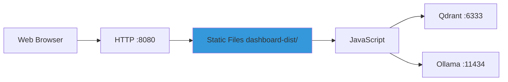

## Network Architecture

### Port Allocation

| Service | Port | Protocol | Access | Required |
|---------|------|----------|--------|----------|
| Qdrant REST | 6333 | HTTP | localhost | ✅ Yes |
| Qdrant gRPC | 6334 | gRPC/HTTP2 | localhost | ✅ Yes |
| Ollama | 11434 | HTTP | localhost | ✅ Yes |
| Dashboard | 8080 | HTTP | localhost | ❌ Optional |

### Network Flow

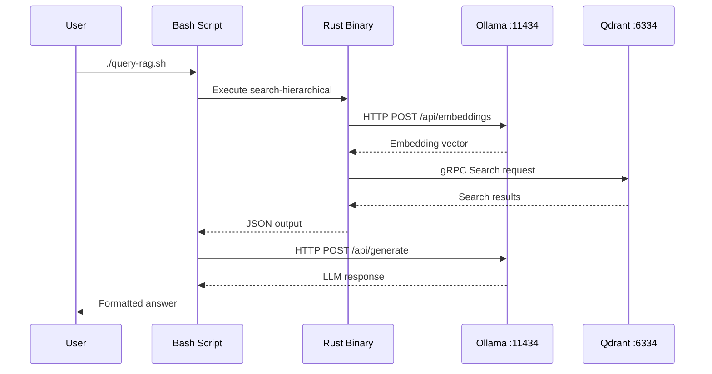

### Firewall Configuration

**Required** (allow on localhost):
- `tcp/6333` - Qdrant REST
- `tcp/6334` - Qdrant gRPC
- `tcp/11434` - Ollama HTTP

**Optional** (for remote dashboard access):
- `tcp/8080` - Dashboard (use reverse proxy in production)

**Security Note**: All ports bound to `127.0.0.1` by default (localhost only). No external exposure.

## Storage Architecture

### Filesystem Layout

```
rag-demo/
├── .git/                       # Git repository
├── .ingested_checksums         # Deduplication (1-5 KB)
├── .ingestion_stats.json       # Stats (< 1 KB)
├── Cargo.toml                  # Rust config
├── CLAUDE.md                   # Dev guide
├── README.md                   # User docs
├── documentation/              # Docs (committed)
│   ├── quick-start.md
│   ├── usage-examples.md
│   └── ...
├── wiki/                       # Wiki pages (NEW)
│   ├── Home.md
│   ├── Architecture-Overview.md
│   ├── Data-Flow-Diagrams.md
│   ├── Rust-Components.md
│   ├── Database-Schema.md
│   └── Deployment-Architecture.md
├── src/                        # Rust source (committed)
│   ├── lib.rs
│   ├── ingest_hierarchical.rs
│   └── ...
├── scripts/                    # Bash scripts (committed)
│   ├── setup-qdrant.sh
│   └── ...
├── target/                     # Build output (gitignored, ~500 MB)
│   └── release/
│       ├── ingest-hierarchical
│       └── ...
├── qdrant_storage/             # Qdrant data (gitignored, varies)
│   ├── collections/
│   ├── storage.sqlite
│   └── .lock
├── extracted/                  # Markdown extracts (gitignored, varies)
│   └── *.md
├── ingest/                     # Source PDFs (gitignored, user data)
│   └── *.pdf
├── dashboard-dist/             # Dashboard build (gitignored, ~2 MB)
│   └── index.html
└── docs/                       # GitHub Pages demo (committed, ~1 MB)
    └── index.html
```

### Storage Capacity Planning

| Component | Typical Size | Growth Rate | Cleanup Strategy |
|-----------|--------------|-------------|------------------|
| Rust binaries | 150 MB | Static | Rebuild as needed |
| Qdrant data | 3.5 KB/doc | Linear | Export/delete old collections |
| PDF sources | User defined | User controlled | Keep originals |
| Markdown extracts | ~50% of PDFs | Linear with ingestion | Safe to delete (regenerate) |
| Dashboard | 2 MB | Static | Rebuild on update |

**Example**: 100 PDFs (50 MB) → ~5000 chunks → ~17.5 MB Qdrant storage

### Backup Strategy

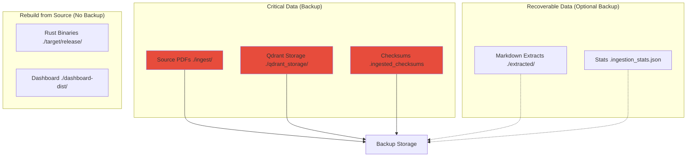

**Recovery Scenarios**:

| Data Lost | Recovery Method | RTO |
|-----------|-----------------|-----|
| Qdrant only | Restore from export OR re-ingest PDFs | 30 min |
| PDFs only | Re-download/locate originals | Varies |
| Checksums | Recompute (or accept re-ingestion) | 5 min |
| Binaries | `cargo build --release` | 5 min |
| Everything | Restore PDFs → re-ingest | Hours |

## Process Management

### Service Dependencies

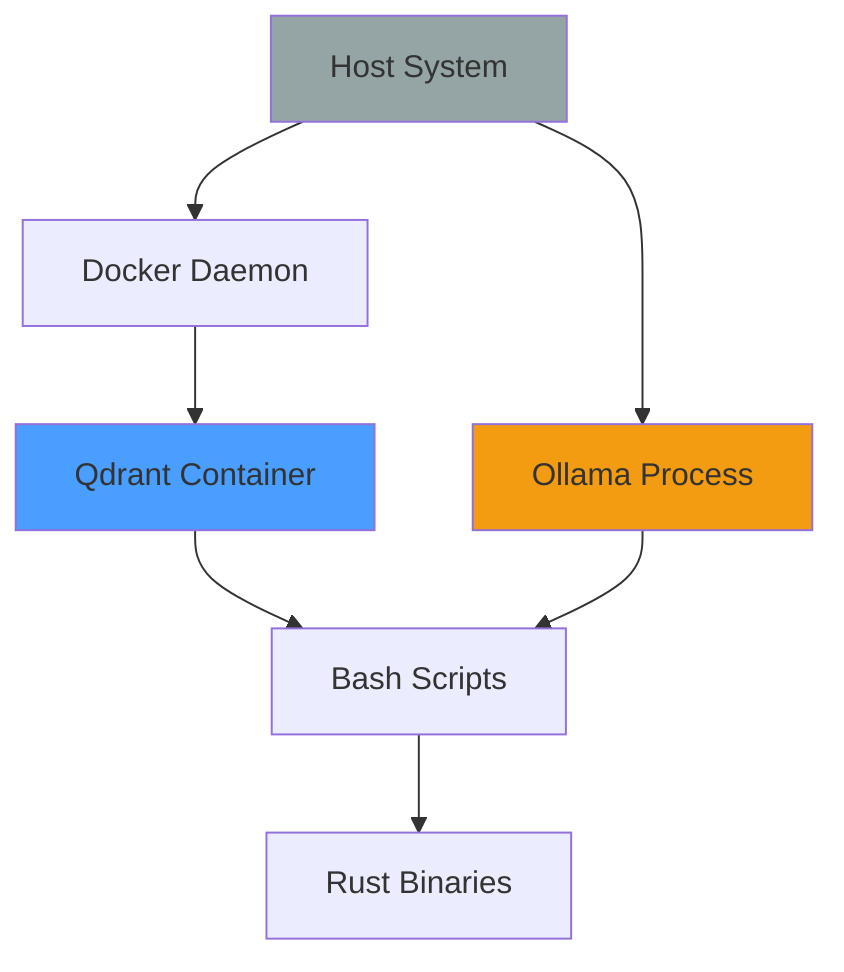

### Startup Sequence

```bash
# 1. Start Docker (if not running)
open -a Docker  # macOS
sudo systemctl start docker  # Linux

# 2. Start Qdrant
./scripts/setup-qdrant.sh  # First time
docker start qdrant         # Subsequent

# 3. Start Ollama
ollama serve &              # Background

# 4. Health check
./scripts/health-check.sh

# 5. Ready to use
./scripts/query-rag.sh "test query"
```

### Shutdown Sequence

```bash
# 1. Stop ongoing operations (Ctrl+C if interactive)

# 2. Stop Ollama
pkill ollama

# 3. Stop Qdrant (optional, can leave running)
docker stop qdrant

# Data persists, safe to restart
```

### Restart After Reboot

```bash
# Services to restart:
1. Docker daemon (usually auto-starts)
2. Qdrant: docker start qdrant
3. Ollama: ollama serve &

# Everything else is stateless
```

## Resource Requirements

### Minimum Requirements

| Component | CPU | RAM | Disk | Notes |
|-----------|-----|-----|------|-------|
| Qdrant | 1 core | 512 MB | 1 GB | Scales with data |
| Ollama | 2 cores | 4 GB | 3 GB | Model dependent |
| Rust binaries | 1 core | 100 MB | 150 MB | During execution |
| **Total** | **2 cores** | **4.5 GB** | **5 GB** | Comfortable minimum |

### Recommended Configuration

| Component | CPU | RAM | Disk | Notes |
|-----------|-----|-----|------|-------|
| Qdrant | 2 cores | 2 GB | 10 GB | Better indexing |
| Ollama | 4 cores | 8 GB | 10 GB | Multiple models |
| Rust binaries | 2 cores | 500 MB | 500 MB | Parallel processing |
| Source PDFs | - | - | Varies | User dependent |
| **Total** | **4 cores** | **10 GB** | **20 GB** | Optimal performance |

### Memory Usage by Operation

```mermaid
gantt
    title Memory Usage During Operations
    dateFormat X
    axisFormat %s MB

    section Idle
    Qdrant: 0, 200
    Ollama: 0, 2048

    section Ingestion
    Qdrant: 0, 500
    Ollama: 0, 4096
    Rust: 0, 200

    section Query
    Qdrant: 0, 300
    Ollama: 0, 3072
    Rust: 0, 50
```

### Performance Scaling

| Data Size | Query Time | Index Time | RAM Usage | Disk Usage |
|-----------|------------|------------|-----------|------------|
| 100 docs | 70 ms | 2 s | 500 MB | 350 KB |
| 1,000 docs | 75 ms | 20 s | 800 MB | 3.5 MB |
| 10,000 docs | 80 ms | 200 s | 2 GB | 35 MB |
| 100,000 docs | 100 ms | 2,000 s | 8 GB | 350 MB |
| 1,000,000 docs | 150 ms | 20,000 s | 32 GB+ | 3.5 GB |

## Scaling Strategies

### Vertical Scaling (Single Machine)

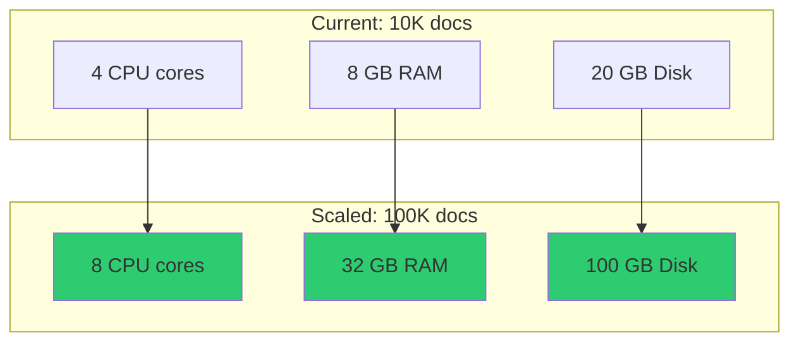

**Optimizations**:
- More RAM → Larger HNSW index in memory
- More CPU → Faster embedding generation
- SSD → Faster Qdrant I/O

### Horizontal Scaling (Multi-Collection)

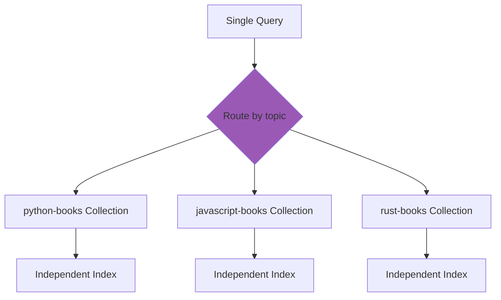

**Benefits**:
- Collections scale independently
- Targeted searches (faster)
- No cross-contamination
- Easier to manage/backup individual collections

### Sharding (Future)

Not currently implemented, but possible with Qdrant:

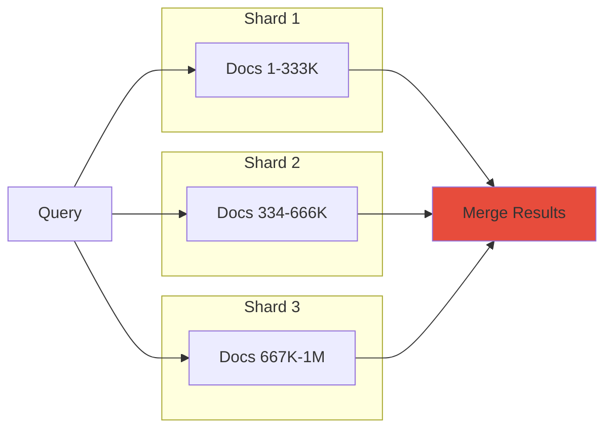

## Monitoring & Health Checks

### Health Check Script

```bash
#!/bin/bash
# ./scripts/health-check.sh

echo "Checking Qdrant..."
if curl -s http://localhost:6333/collections > /dev/null; then
    echo "✅ Qdrant: Running"
else
    echo "❌ Qdrant: Not running"
fi

echo "Checking Ollama..."
if curl -s http://localhost:11434/api/tags > /dev/null; then
    echo "✅ Ollama: Running"
else
    echo "❌ Ollama: Not running"
fi

echo "Checking collections..."
curl -s http://localhost:6333/collections | jq -r '.result.collections[].name'
```

### Monitoring Metrics

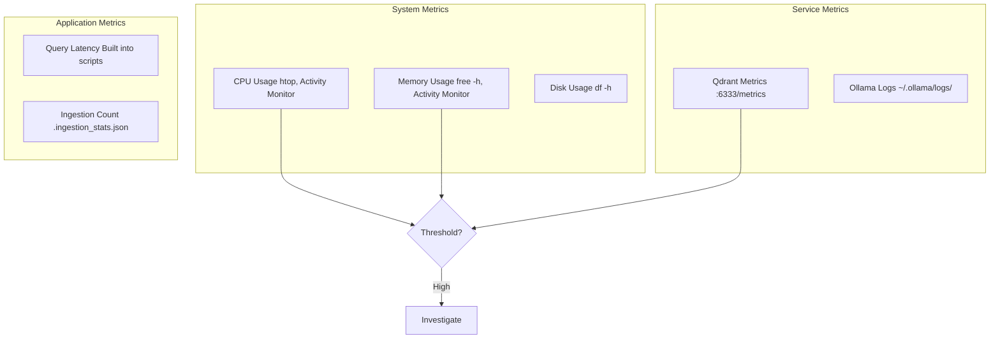

### Key Metrics to Monitor

| Metric | Command | Healthy Range | Alert Threshold |
|--------|---------|---------------|-----------------|
| Qdrant Memory | `docker stats qdrant` | < 2 GB | > 4 GB |
| Ollama Memory | `ps aux \| grep ollama` | < 4 GB | > 8 GB |
| Query Latency | Built into scripts | < 100 ms | > 500 ms |
| Disk Usage | `du -sh qdrant_storage` | < 80% | > 90% |

### Troubleshooting Checklist

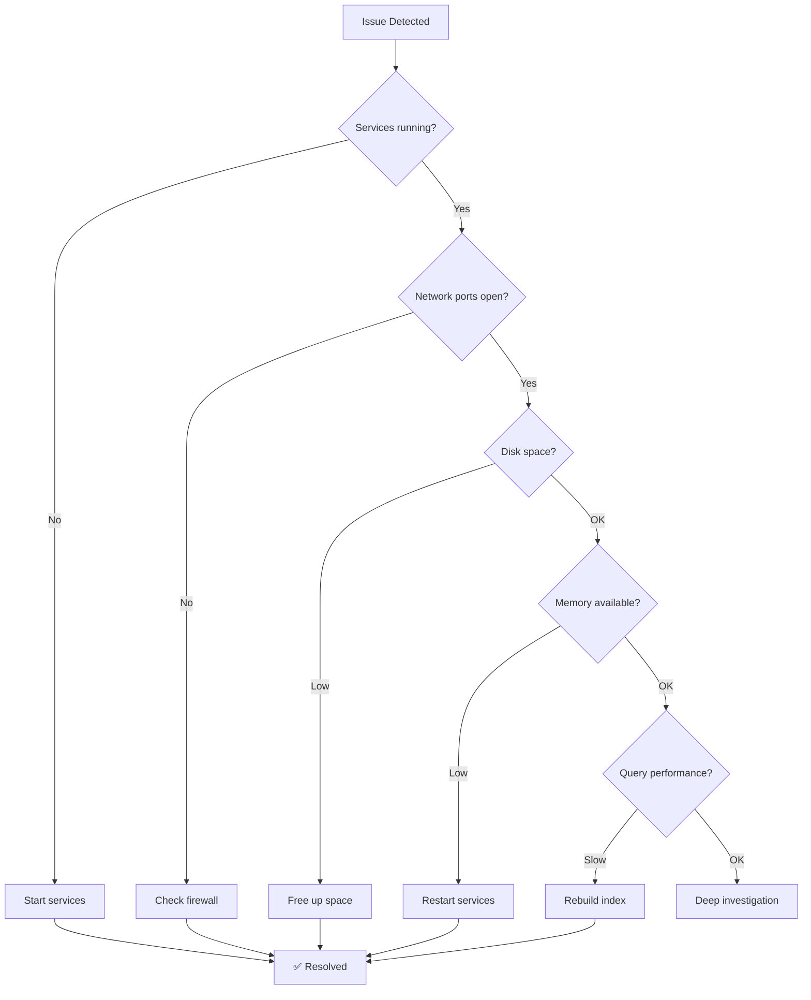

## Related Documentation

- [Architecture Overview](Architecture-Overview) - System design principles
- [Database Schema](Database-Schema) - Qdrant configuration and storage
- [Rust Components](Rust-Components) - Binary details
- [Data Flow Diagrams](Data-Flow-Diagrams) - Process flows
- [Quick Start Guide](https://github.com/softwarewrighter/rag-demo/blob/main/documentation/quick-start.md) - Setup walkthrough

---

**Last Updated**: 2025-11-17
**Related**: [Home](Home) | [Architecture](Architecture-Overview) | [Database](Database-Schema)
