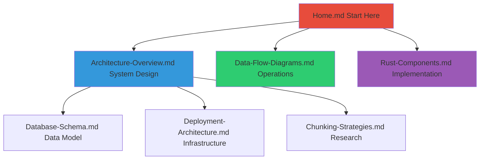

# RAG Demo Wiki

> **Copyright © 2025 Michael A. Wright** | Licensed under the [MIT License](https://github.com/softwarewrighter/rag-demo/blob/main/LICENSE)

## About This Wiki

This wiki provides comprehensive technical architecture documentation for the RAG Demo project. It's designed for developers, DevOps engineers, and anyone wanting to understand the system's internal design.

## Using This Wiki

### On GitHub

To use this wiki on GitHub:

1. Navigate to the repository's Wiki tab (if enabled)
2. Copy the contents of this `wiki/` directory to the GitHub Wiki repository
3. The Wiki will automatically render Mermaid diagrams and format Markdown

### Locally

To browse locally:

```bash
# Option 1: Use a Markdown viewer
# Install grip: pip install grip
cd wiki
grip Home.md

# Option 2: Use VS Code
code Home.md  # Open in VS Code with Markdown Preview

# Option 3: Convert to HTML
# Install pandoc: brew install pandoc
for f in *.md; do
  pandoc "$f" -o "${f%.md}.html" --standalone
done
```

### Structure

```
wiki/
├── README.md                      # This file
├── Home.md                        # Wiki home page (start here)
├── Architecture-Overview.md       # High-level system architecture
├── Data-Flow-Diagrams.md         # Sequence diagrams for operations
├── Rust-Components.md            # Detailed component documentation
├── Database-Schema.md            # Qdrant structure and configuration
├── Deployment-Architecture.md    # Infrastructure and deployment
└── Chunking-Strategies.md       # Research and implementation
```

## Documentation Hierarchy



## Viewing Mermaid Diagrams

The wiki includes many Mermaid diagrams for visualizing architecture and flows.

### On GitHub

GitHub automatically renders Mermaid diagrams in Markdown files.

### Locally

**Option 1**: VS Code with Extensions
```bash
code --install-extension bierner.markdown-mermaid
```

**Option 2**: Mermaid Live Editor
1. Copy diagram code
2. Visit https://mermaid.live/
3. Paste and view

**Option 3**: Mermaid CLI
```bash
npm install -g @mermaid-js/mermaid-cli
mmdc -i Architecture-Overview.md -o architecture.pdf
```

## Quick Navigation

### For New Developers
1. Start: [Home.md](Home)
2. Understand: [Architecture-Overview.md](Architecture-Overview)
3. Explore: [Rust-Components.md](Rust-Components)
4. Deep Dive: [Chunking-Strategies.md](Chunking-Strategies)

### For DevOps/SRE
1. Start: [Home.md](Home)
2. Setup: [Deployment-Architecture.md](Deployment-Architecture)
3. Data: [Database-Schema.md](Database-Schema)
4. Operations: [Data-Flow-Diagrams.md](Data-Flow-Diagrams)

### For Data Scientists
1. Start: [Home.md](Home)
2. Research: [Chunking-Strategies.md](Chunking-Strategies)
3. Architecture: [Architecture-Overview.md](Architecture-Overview)
4. Implementation: [Rust-Components.md](Rust-Components)

## Contributing to This Wiki

### Adding New Pages

1. Create Markdown file in `wiki/` directory
2. Add to navigation in `Home.md`
3. Link from related pages
4. Follow existing format/style
5. Include Mermaid diagrams where helpful

### Documentation Standards

**File Naming**:
- Use PascalCase: `New-Page.md`
- No spaces in filenames
- Descriptive names

**Content Structure**:
```markdown
# Page Title

> **Copyright © 2025 Michael A. Wright** | Licensed under the [MIT License](https://github.com/softwarewrighter/rag-demo/blob/main/LICENSE)

## Table of Contents
- [Section 1](#section-1)
- [Section 2](#section-2)

## Section 1

Content...

## Related Documentation

- [Other Page](Other-Page)

---

**Last Updated**: YYYY-MM-DD
**Related**: [Home](Home) | [Other](Other-Page)
```

**Diagrams**:
- Use Mermaid for all diagrams
- Keep diagrams simple and focused
- Add colors sparingly for emphasis
- Include diagram legends if complex

**Code Examples**:
- Use syntax highlighting (```rust, ```bash, etc.)
- Keep examples concise
- Include comments for clarity
- Test that code works

### Updating Existing Pages

1. Update content
2. Update "Last Updated" date
3. Test all links still work
4. Verify Mermaid diagrams render
5. Update cross-references if structure changed

## Exporting Wiki

### To PDF

```bash
# Install pandoc and eisvogel template
brew install pandoc
brew install --cask basictex

# Download template
mkdir -p ~/.pandoc/templates
curl -o ~/.pandoc/templates/eisvogel.tex \
  https://raw.githubusercontent.com/Wandmalfarbe/pandoc-latex-template/master/eisvogel.tex

# Generate PDF
pandoc Home.md \
  --from markdown \
  --to pdf \
  --output RAG-Demo-Wiki.pdf \
  --template eisvogel \
  --listings \
  --toc
```

### To HTML Site

```bash
# Install mkdocs
pip install mkdocs mkdocs-material

# Create mkdocs.yml in wiki/
cat > mkdocs.yml << EOF
site_name: RAG Demo Wiki
theme:
  name: material
nav:
  - Home: Home.md
  - Architecture: Architecture-Overview.md
  - Data Flow: Data-Flow-Diagrams.md
  - Components: Rust-Components.md
  - Database: Database-Schema.md
  - Deployment: Deployment-Architecture.md
  - Chunking: Chunking-Strategies.md
EOF

# Build site
mkdocs build

# Serve locally
mkdocs serve
# Visit http://localhost:8000
```

## Additional Resources

### Main Project Documentation
- [README.md](https://github.com/softwarewrighter/rag-demo/blob/main/README.md) - User-facing documentation
- [CLAUDE.md](https://github.com/softwarewrighter/rag-demo/blob/main/CLAUDE.md) - Development guide
- [Quick Start](https://github.com/softwarewrighter/rag-demo/blob/main/documentation/quick-start.md) - Setup walkthrough
- [Usage Examples](https://github.com/softwarewrighter/rag-demo/blob/main/documentation/usage-examples.md) - Real-world scenarios
- [Research](https://github.com/softwarewrighter/rag-demo/blob/main/documentation/research.md) - Background research

### External Resources
- [Qdrant Documentation](https://qdrant.tech/documentation/)
- [Ollama Documentation](https://github.com/ollama/ollama/blob/main/docs/README.md)
- [Rust Book](https://doc.rust-lang.org/book/)
- [Mermaid Documentation](https://mermaid.js.org/intro/)

## Troubleshooting

### Diagrams Not Rendering

**Problem**: Mermaid diagrams show as code blocks

**Solution**:
- GitHub: Should work automatically in Wiki
- VS Code: Install `bierner.markdown-mermaid` extension
- Other: Use Mermaid Live Editor

### Links Broken

**Problem**: Cross-references don't work

**Solution**:
- Ensure filenames match exactly (case-sensitive)
- Use relative paths: `[Link](Other-Page)`
- For sections: `[Link](Page.md#section-name)`

### Images Not Loading

**Problem**: Screenshots or images missing

**Note**: This wiki currently uses only Mermaid diagrams (no images). If adding images:
- Store in `wiki/images/` directory
- Reference as: ``
- Commit images to repository

## Maintenance

### Regular Updates

This wiki should be updated when:
- ✅ Architecture changes significantly
- ✅ New components added
- ✅ Deployment process changes
- ✅ Research findings change approach
- ❌ Minor bug fixes (use git comments)
- ❌ Code refactoring (unless architectural)

### Review Schedule

- **Quarterly**: Review all pages for accuracy
- **On major releases**: Update version-specific info
- **On architecture changes**: Immediate update

## Contact

For questions about this documentation:
- Open an issue on GitHub
- Review [CLAUDE.md](https://github.com/softwarewrighter/rag-demo/blob/main/CLAUDE.md) for development guide
- Check [Learnings](https://github.com/softwarewrighter/rag-demo/blob/main/documentation/learnings.md) for common issues

---

**Last Updated**: 2025-11-17
**License**: MIT
**Repository**: https://github.com/softwarewrighter/rag-demo
