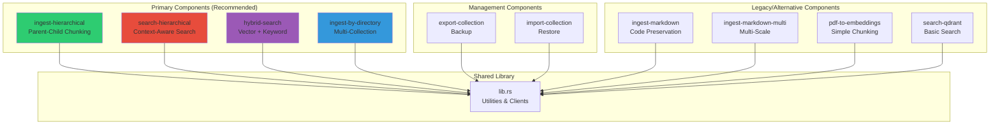
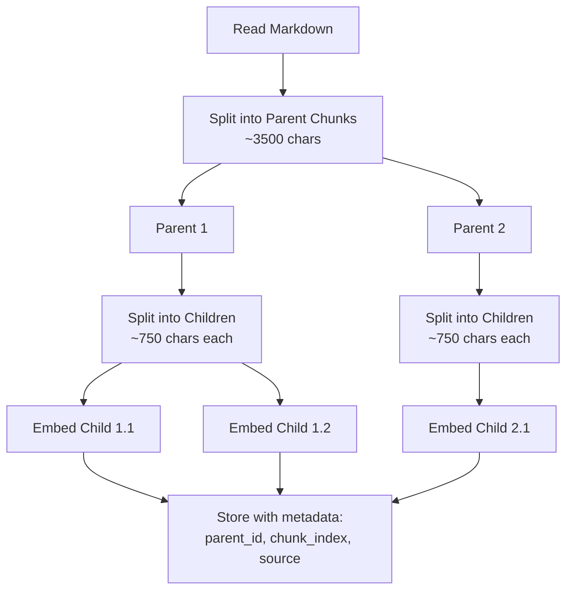
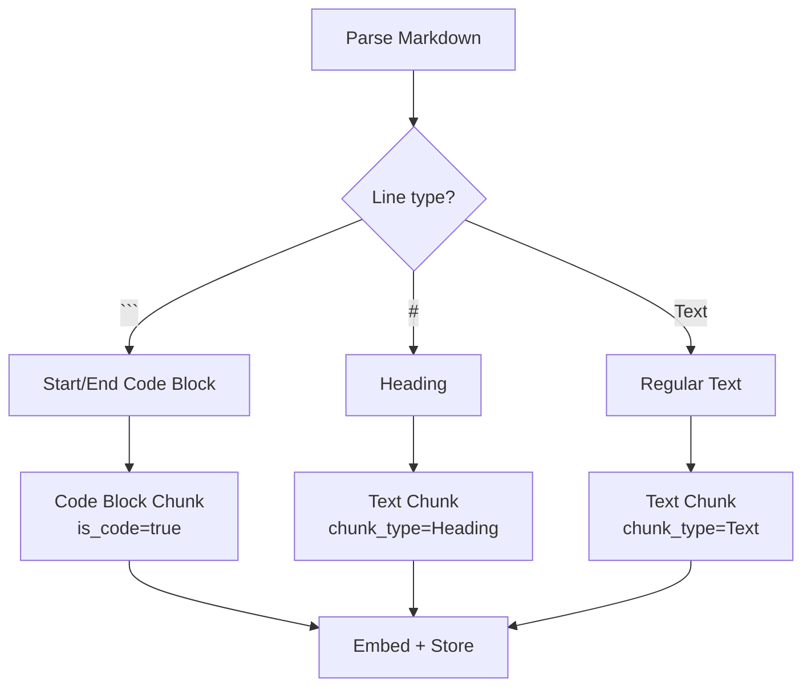
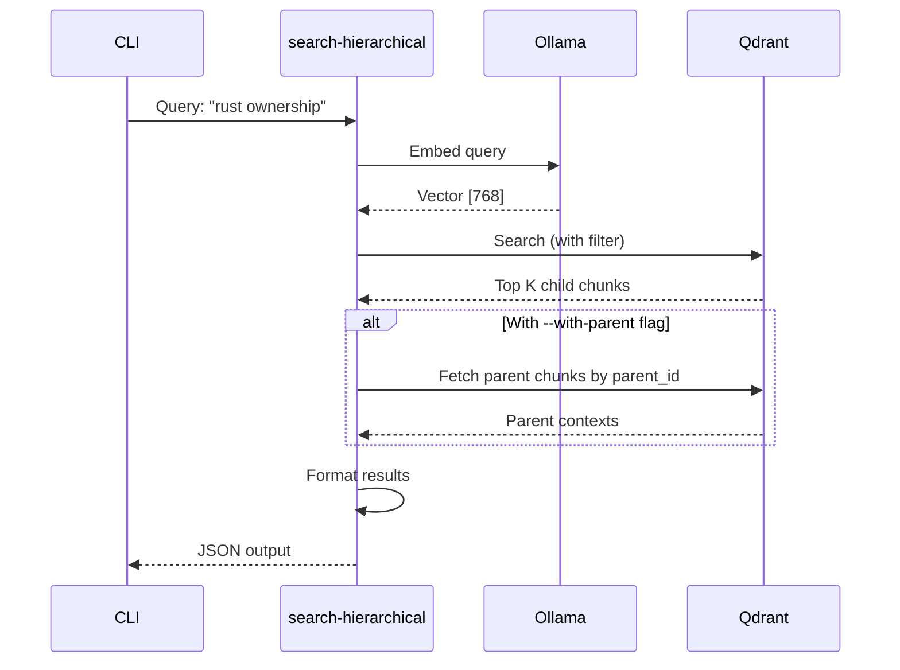
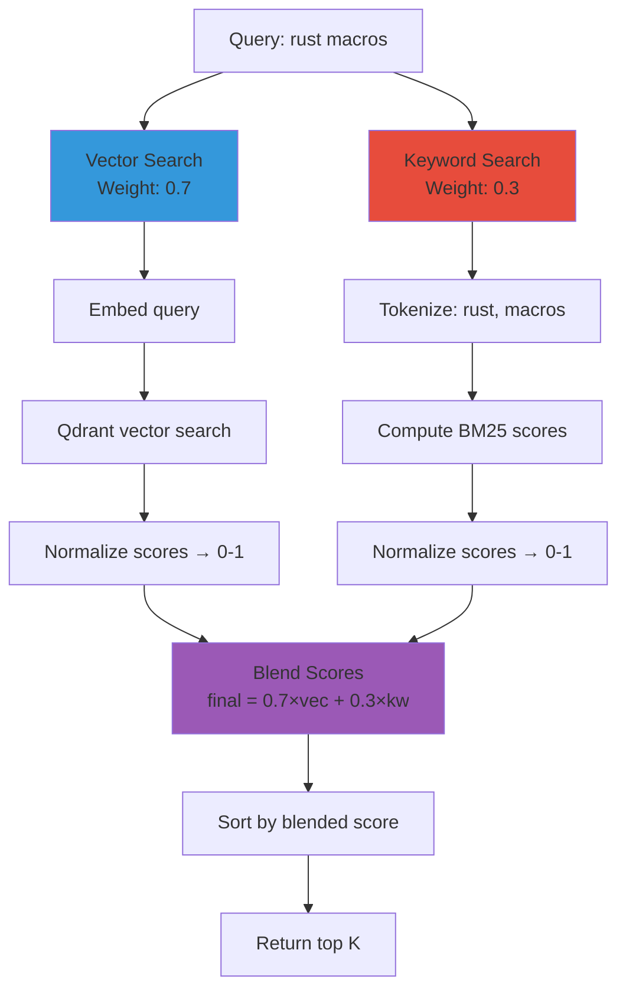
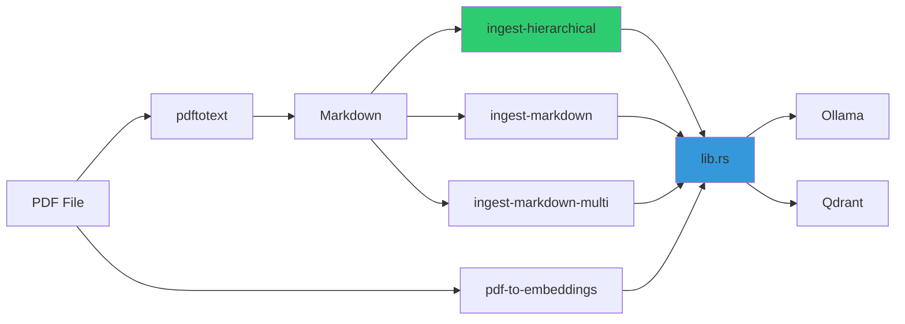
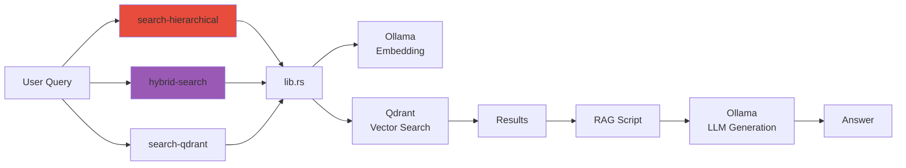

# Rust Components

> **Copyright © 2025 Michael A. Wright** | Licensed under the [MIT License](../LICENSE)

## Table of Contents
- [Component Overview](#component-overview)
- [Core Library (lib.rs)](#core-library-librs)
- [Ingestion Components](#ingestion-components)
- [Search Components](#search-components)
- [Management Components](#management-components)
- [Component Interactions](#component-interactions)
- [Testing Strategy](#testing-strategy)

## Component Overview

The RAG Demo system comprises 11 Rust binaries and 1 shared library. Each component follows the Unix philosophy: **do one thing and do it well**.

### Component Classification



## Core Library (lib.rs)

### Purpose
Shared functionality and client wrappers used by all binaries.

### Key Functions

#### Ollama Client
```rust
pub async fn get_embedding(text: &str, model: &str) -> Result<Vec<f32>>
```
- Generates 768-dimensional embeddings
- Uses Ollama's `/api/embeddings` endpoint
- Default model: `nomic-embed-text`
- Error handling for connection failures

**Usage Example**:
```rust
let embedding = get_embedding("sample text", "nomic-embed-text").await?;
assert_eq!(embedding.len(), 768);
```

#### Qdrant Client Utilities
```rust
pub async fn ensure_collection_exists(
    client: &Qdrant,
    name: &str,
    vector_size: u64
) -> Result<()>
```
- Creates collection if missing
- Configures HNSW indexing (m=16, ef_construct=200)
- Sets cosine distance metric
- Idempotent (safe to call multiple times)

**Collection Configuration**:
- **Distance**: Cosine (optimal for normalized embeddings)
- **Vector size**: 768 (nomic-embed-text output)
- **HNSW m**: 16 (connections per node)
- **HNSW ef_construct**: 200 (build-time accuracy)
- **Indexing threshold**: 100 vectors

#### Chunking Utilities
```rust
pub fn chunk_text_simple(text: &str, size: usize, overlap: usize) -> Vec<String>
pub fn chunk_text_hierarchical(text: &str) -> (Vec<Parent>, Vec<Child>)
```

**Simple Chunking**:
- Fixed-size chunks with overlap
- Used by legacy `pdf-to-embeddings`

**Hierarchical Chunking**:
- Parent chunks: ~3500 chars
- Child chunks: ~750 chars
- Preserves parent-child relationships
- Used by `ingest-hierarchical`

### Dependencies
```toml
[dependencies]
qdrant-client = "1.12"
reqwest = { version = "0.12", features = ["json"] }
serde = { version = "1.0", features = ["derive"] }
serde_json = "1.0"
anyhow = "1.0"
tokio = { version = "1", features = ["full"] }
```

### Testing
The library includes comprehensive unit tests for all utility functions.

```bash
cargo test --lib
```

## Ingestion Components

### 1. ingest-hierarchical (Primary)

**File**: `src/ingest_hierarchical.rs`

**Purpose**: Primary ingestion tool using hierarchical parent-child chunking.

**Features**:
- PDF → Markdown → Hierarchical chunks
- Parent chunks (~3500 chars) for context
- Child chunks (~750 chars) for retrieval
- Collection awareness (respects `RAG_COLLECTION` env var)
- Does NOT delete existing collections (fixed bug)

**Algorithm**:


**Usage**:
```bash
# Single collection
./target/release/ingest-hierarchical document.md

# Specific collection
RAG_COLLECTION=python-books ./target/release/ingest-hierarchical doc.md
```

**Metadata Stored**:
| Field | Type | Description |
|-------|------|-------------|
| `text` | string | Child chunk text |
| `parent_text` | string | Full parent chunk for context |
| `parent_id` | string | UUID of parent chunk |
| `chunk_index` | integer | Position within parent |
| `source` | string | Original filename |
| `chunk_type` | string | "Text", "Code", etc. |
| `is_code` | boolean | True if code block |

**Testing**:
```bash
cargo test --bin ingest-hierarchical
# 15+ tests covering chunking logic
```

### 2. ingest-by-directory (Multi-Collection)

**File**: `src/ingest_by_directory.rs`

**Purpose**: Processes subdirectories into separate collections.

**Features**:
- Each subdirectory → separate collection
- Collection naming: `{dirname}-books`
- Batch processing of all PDFs in directory
- Progress tracking per collection

**Directory Structure**:
```
ingest/
├── rust/          → rust-books collection
│   ├── book1.pdf
│   └── book2.pdf
├── python/        → python-books collection
│   └── guide.pdf
└── javascript/    → javascript-books collection
    └── ref.pdf
```

**Usage**:
```bash
./target/release/ingest-by-directory ./ingest
```

**Output**:
```
Processing directory: rust → rust-books
  ✓ book1.pdf (142 chunks)
  ✓ book2.pdf (200 chunks)
Processing directory: python → python-books
  ✓ guide.pdf (95 chunks)
...
```

### 3. ingest-markdown (Code-Aware)

**File**: `src/ingest_markdown.rs`

**Purpose**: Smart markdown chunking that preserves code blocks.

**Features**:
- Detects fenced code blocks (```)
- Keeps code blocks intact (no splitting mid-code)
- Metadata tagging for code vs text
- Preserves code context

**Algorithm**:


**Usage**:
```bash
./target/release/ingest-markdown document.md
```

**Metadata Enhancements**:
- `is_code`: boolean flag
- `code_language`: language from fence (```rust)
- `chunk_type`: "Code", "Text", "Heading"

### 4. ingest-markdown-multi (Multi-Scale)

**File**: `src/ingest_markdown_multi.rs`

**Purpose**: Experimental multi-scale chunking at different granularities.

**Features**:
- Chunks at 3 sizes: small (500), medium (2000), large (4000)
- Stores in separate collections
- Enables size-specific search

**Collections Created**:
- `{base}_small`: Fine-grained (500 chars)
- `{base}_medium`: Balanced (2000 chars)
- `{base}_large`: Full context (4000 chars)

**Use Case**: Research and experimentation with multi-scale retrieval.

### 5. pdf-to-embeddings (Legacy)

**File**: `src/pdf_to_embeddings.rs`

**Purpose**: Original simple chunking implementation.

**Features**:
- Fixed 1000-char chunks
- 200-char overlap
- No hierarchy
- Direct PDF processing (pdf-extract crate)

**Limitations**:
- Splits code mid-block
- Less context preservation
- No parent-child relationships

**Status**: Legacy, kept for backward compatibility. Use `ingest-hierarchical` instead.

## Search Components

### 1. search-hierarchical (Context-Aware)

**File**: `src/search_hierarchical.rs`

**Purpose**: Search with parent-child awareness.

**Features**:
- Returns child chunks (precise matches)
- Can retrieve parent chunks (full context)
- Supports metadata filtering
- Collection-aware

**Query Flow**:


**Usage**:
```bash
# Basic search
./target/release/search-hierarchical "rust ownership" --limit 5

# With parent context
./target/release/search-hierarchical "macros" --with-parent

# Specific collection
RAG_COLLECTION=rust-books ./target/release/search-hierarchical "lifetimes"
```

**Output Format**:
```json
{
  "query": "rust ownership",
  "results": [
    {
      "score": 0.87,
      "text": "Ownership is Rust's most unique feature...",
      "parent_text": "Full chapter context...",
      "source": "rust-book.pdf",
      "chunk_index": 3
    }
  ],
  "search_time_ms": 67
}
```

**Testing**:
```bash
cargo test --bin search-hierarchical
# 10+ tests for serialization/deserialization
```

### 2. hybrid-search (Vector + Keyword)

**File**: `src/hybrid_search.rs`

**Purpose**: Combines semantic vector search with keyword matching.

**Features**:
- Configurable vector/keyword weights
- BM25 keyword scoring
- Metadata filtering
- Score blending and normalization

**Algorithm**:


**BM25 Scoring**:
```
score(D,Q) = Σ IDF(qi) × (f(qi,D) × (k1 + 1)) / (f(qi,D) + k1 × (1 - b + b × |D| / avgdl))

where:
- f(qi,D): term frequency in document
- |D|: document length
- avgdl: average document length
- k1: 1.2 (term frequency saturation)
- b: 0.75 (length normalization)
```

**Usage**:
```bash
# Default weights (70% vector, 30% keyword)
./target/release/hybrid-search "rust macros"

# Custom weights
./target/release/hybrid-search "error handling" -v 0.5 -k 0.5

# With metadata filter
./target/release/hybrid-search "fn main" --filter is_code=true --filter source=rust-book.pdf

# More results
./target/release/hybrid-search "async await" --limit 20
```

**When to Use**:
| Scenario | Recommended Weights |
|----------|---------------------|
| Code search (exact symbols) | -v 0.3 -k 0.7 |
| Conceptual questions | -v 0.9 -k 0.1 |
| Technical terms | -v 0.7 -k 0.3 (default) |
| Documentation lookup | -v 0.5 -k 0.5 |

**Testing**:
```bash
cargo test --bin hybrid-search
# 11+ tests for keyword scoring and filtering
```

### 3. search-qdrant (Basic)

**File**: `src/search_qdrant.rs`

**Purpose**: Simple vector-only search without hierarchy.

**Features**:
- Pure vector similarity
- No parent-child awareness
- Fast and simple

**Status**: Used by legacy scripts. Prefer `search-hierarchical` for new code.

## Management Components

### 1. export-collection (Backup)

**File**: `src/export_collection.rs`

**Purpose**: Export Qdrant collections to JSON for backup or sharing.

**Features**:
- Optional vector inclusion (--include-vectors)
- Pretty printing (--pretty)
- Metadata preservation
- Batch scrolling (100 points per request)

**Export Format**:
```json
{
  "metadata": {
    "collection_name": "python-books",
    "export_date": "2025-11-17T10:30:00Z",
    "point_count": 342,
    "vector_size": 768,
    "distance": "Cosine"
  },
  "config": {
    "vector_params": {
      "size": 768,
      "distance": "Cosine"
    },
    "hnsw_config": {
      "m": 16,
      "ef_construct": 200
    }
  },
  "points": [
    {
      "id": "uuid-here",
      "vector": [0.123, 0.456, ...],  // Optional
      "payload": {
        "text": "...",
        "source": "...",
        ...
      }
    }
  ]
}
```

**Usage**:
```bash
# Payload only (smaller file, for inspection)
./target/release/export-collection python-books

# With vectors (required for restore)
./target/release/export-collection python-books --include-vectors

# Pretty formatted
./target/release/export-collection python-books --include-vectors --pretty

# Custom output location
./target/release/export-collection python-books -o backup.json --include-vectors
```

**File Sizes**:
| Collection Size | Without Vectors | With Vectors |
|-----------------|-----------------|--------------|
| 100 points | ~50 KB | ~2 MB |
| 1000 points | ~500 KB | ~20 MB |
| 10000 points | ~5 MB | ~200 MB |

**Testing**:
```bash
cargo test --bin export-collection
# 4+ tests for data structures
```

### 2. import-collection (Restore)

**File**: `src/import_collection.rs`

**Purpose**: Import collections from JSON backups.

**Features**:
- Collection creation if missing
- Merge mode with --force flag
- Vector validation
- Batch upsert (100 points per request)

**Usage**:
```bash
# Import to same collection name
./target/release/import-collection exports/python-books.json

# Import to different collection
./target/release/import-collection backup.json --collection python-docs

# Force merge with existing collection
./target/release/import-collection backup.json --force
```

**Validation**:
- Checks JSON structure validity
- Verifies vector presence (required)
- Validates vector dimensions match
- Confirms collection config compatibility

**Error Handling**:
```bash
# Missing vectors
❌ Error: Export does not contain vectors. Re-export with --include-vectors

# Collection exists
❌ Error: Collection 'python-books' already exists. Use --force to merge

# Dimension mismatch
❌ Error: Vector dimension mismatch (expected 768, got 384)
```

**Testing**:
```bash
cargo test --bin import-collection
# 4+ tests for import validation
```

## Component Interactions

### Ingestion Pipeline



### Search Pipeline



## Testing Strategy

### Unit Tests
Each binary includes comprehensive unit tests:

```bash
# Test all binaries
cargo test --all-targets --all-features

# Test specific binary
cargo test --bin ingest-hierarchical
cargo test --bin hybrid-search

# Test library
cargo test --lib

# Verbose output
cargo test -- --nocapture
```

### Test Coverage by Component

| Component | Test Count | Coverage Areas |
|-----------|------------|----------------|
| `ingest-hierarchical` | 15+ | Chunking logic, parent-child relationships |
| `search-hierarchical` | 10+ | Serialization, deserialization, result formatting |
| `hybrid-search` | 11+ | BM25 scoring, keyword matching, filtering |
| `export-collection` | 4+ | JSON structure, metadata |
| `import-collection` | 4+ | Validation, error handling |
| `lib.rs` | 20+ | Utilities, chunking, clients |

### Integration Tests
Located in `tests/` directory (future expansion):

```bash
cargo test --test integration
```

### CI/CD Pipeline
Automated testing on every push via GitHub Actions:
- All unit tests must pass
- Clippy with zero warnings
- Code formatting checks
- Build all binaries

```yaml
# .github/workflows/ci.yml
- cargo test --all-features --verbose
- cargo clippy --all-targets --all-features -- -D warnings
- cargo fmt --all -- --check
- cargo build --release --all-targets
```

## Performance Benchmarks

### Component Benchmarks

| Component | Operation | Typical Time | Notes |
|-----------|-----------|--------------|-------|
| `ingest-hierarchical` | Process 1 PDF | ~30s | Varies by size |
| `ingest-hierarchical` | Embed 1 chunk | ~150ms | Ollama latency |
| `search-hierarchical` | Query + search | ~70ms | With HNSW index |
| `hybrid-search` | Hybrid query | ~90ms | +20ms vs pure vector |
| `export-collection` | Export 1000 pts | ~3s | With vectors |
| `import-collection` | Import 1000 pts | ~5s | Batch upsert |

### Memory Usage

| Component | Typical Memory | Peak Memory |
|-----------|----------------|-------------|
| `ingest-hierarchical` | 50 MB | 200 MB (large PDFs) |
| `search-hierarchical` | 20 MB | 30 MB |
| `hybrid-search` | 30 MB | 50 MB |
| Qdrant (Docker) | 200 MB | 1 GB (large collections) |
| Ollama | 2 GB | 4 GB (model loaded) |

## Related Documentation

- [Architecture Overview](Architecture-Overview.md) - System design
- [Data Flow Diagrams](Data-Flow-Diagrams.md) - Sequence diagrams
- [Database Schema](Database-Schema.md) - Qdrant structure
- [Chunking Strategies](Chunking-Strategies.md) - Research and implementation
- [Testing Guide](../CLAUDE.md#testing--validation) - Quality gates

---

**Last Updated**: 2025-11-17
**Related**: [Home](Home.md) | [Architecture](Architecture-Overview.md) | [Data Flow](Data-Flow-Diagrams.md)
